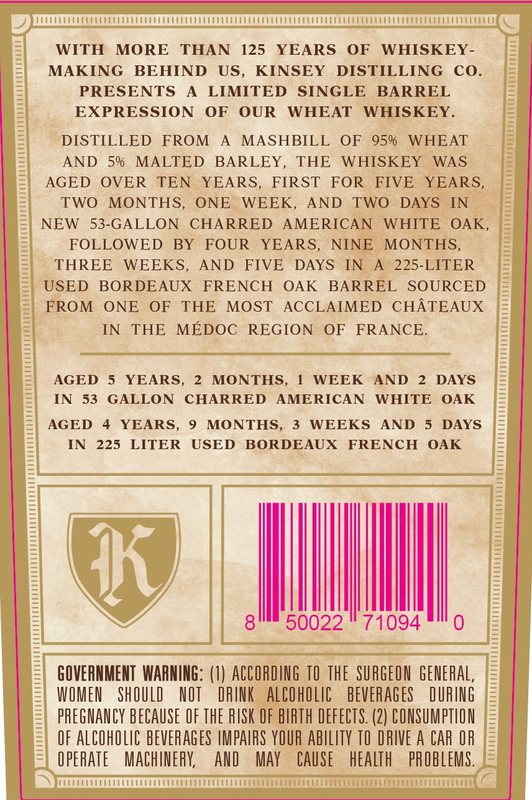
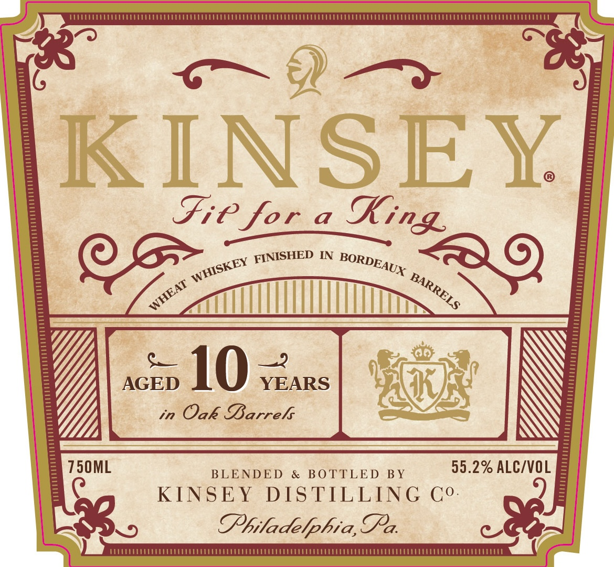
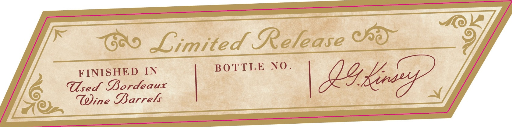

# TTB COLA Label Images - TTBID 26243001000128

**Brand Name:** KINSEY

**Issue Date:** 09/09/2026

**Origin Code:** 39

**Product Class/Type:** 140

**Source:** [TTB Public COLA Registry](https://ttbonline.gov/colasonline/viewColaDetails.do?action=publicFormDisplay&ttbid=26243001000128)

## Label Images

### Back Label

### Front Label

### Label 3

## Extracted Label Text

*Text extracted via OCR - may contain errors*

**Detected Proof:** 95

### Back Label

WITH
MORE
THAN
125
YEARS
OF
WHISKEY -
MAKING
BEHIND
US,
KINSEY
DISTILLING
Co_
PRESENTS
A
LIMITED
SINGLE
BARREL
EXPRESSION
OF
OUR
WHEAT
WHISKEY.
DISTILLED
FROM
MASHBILL
OF
95%
WHEAT
AND
5%
MALTED
BARLEY,
THE
WHISKEY
WAS
AGED
OVER
TEN
YEARS,
FIRST
FOR
FIVE
YEARS_
TWO
MONTHS
ONE
WEEK,
AND
TWO
DAYS
IN
NEW
53-GALLON
CHARRED
AMERICAN
WHITE
OAK
FOLLOWED
BY
FOUR
YEARS,
NINE
MONTHS;
THREE
WEEKS,
AND
FIVE
DAYS
IN
225-LITER
USED
BORDEAUX
FRENCH
OAK
BARREL
SOURCED
FROM
ONE
OF
THE
MOST
ACCLAIMED
CHATEAUX
IN
THE
MEDOC
REGION
OF
FRANCE.
AGED
YEARS,
MONTHS,
WEEK
AND
DAYS
IN
53
GALLON
CHARRED
AMERICAN
WHITE
OAK
AGED
YEARS,
MONTHS,
WEEKS
AND
DAYS
IN
225
LITER
USED
BORDEAUX
FRENCH
OAK
Ik
8
50022
71094
GOVERNMENT  WARNING: (1) ACCORDING TO THE  SURGEON GENERAL,
WOMEU
ShOULD
HOT
DRIK
alCoholic
BEVERAGES
DURING
pREGMANCY BECAUSE OF ThE RISK OF BIRTH DEFECTS. (2) CONSUMPTLON
OF AlCOhOLIC BEVERAGES LMPAIRS YOUR abIlITy TO DRIVE A CAR OR
opERATe
MachiNeRK
AnD
May
CAUSe
health
PROBLEMS.

### Front Label

KINSEY
Fie for
a
IN
10
3
AGED
YEARS
in
Oak Barrels
750ML
BLENDED
&
BO TTLED
BY
55.2% ALC/VOL
KINSEY
DIS TILLING
Co.
@hiladelphia,Ta.
King
FINISHED
BORDEAUX
WHISKEY
BARRELS
WHEAT

### Label 3

(oo
 imited Release
FINISHED
IN
BOTTLE
NO .
Tsed Sordeaux
exensdt
Toline Sarrel
