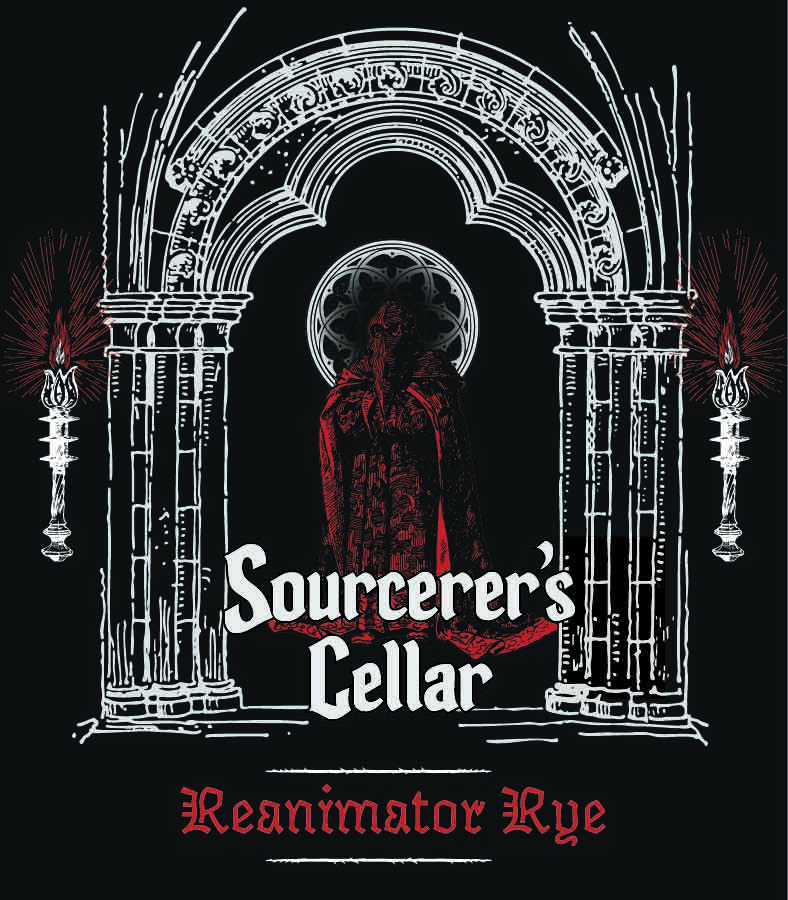
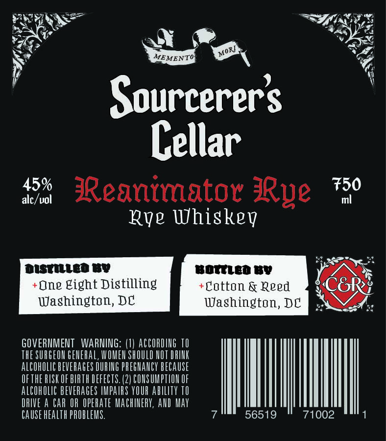

# TTB COLA Label Images - TTBID 26243001000196

**Brand Name:** COTTON & REED

**Fanciful Name:** REANIMATOR RYE

**Issue Date:** 09/03/2026

**Origin Code:** 4K

**Product Class/Type:** 142

**Source:** [TTB Public COLA Registry](https://ttbonline.gov/colasonline/viewColaDetails.do?action=publicFormDisplay&ttbid=26243001000196)

## Label Images

### Back Label

### Front Label

## Extracted Label Text

*Text extracted via OCR - may contain errors*

*1 image(s) excluded: text did not meet readability threshold*

**Detected Proof:** 90

### Front Label

Sourcerers
Cellar
45%
Reanimator
750
alc/uol
m
Rqg Uhiskev
dustulled Bv
One gight Distilling
Waghington, DC
GOVERMMENT  WARNING: (I) ACCORDIg TO
THE SURGEOH GEHERAL, WOMEN SHOULD HOT DRIHK
ALCOhOLIC BEVERAGES DURIHG PREGHAHCY BECAUSE
OF THE RISK OF BIRTH DEFECTS. (2) CONSUMPTIOU OF
ALcOhOlIC BEVERAGES IMPArS YOUR ablIty TO
DRIVE A Car OR OPERATE MAChErY, AHD May
CAUSE HEaLTh PROBLEMS.
56519
71002
RRve
