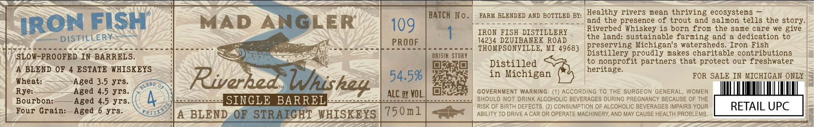

# TTB COLA Label Images - TTBID 26243001000228

**Brand Name:** MAD ANGLER

**Issue Date:** 09/03/2026

**Origin Code:** 06

**Product Class/Type:** 120

**Source:** [TTB Public COLA Registry](https://ttbonline.gov/colasonline/viewColaDetails.do?action=publicFormDisplay&ttbid=26243001000228)

## Label Images

### Label 1

## Extracted Label Text

*Text extracted via OCR - may contain errors*

**Detected Proof:** 109
**Detected Age:** 3.5 Years

### Label 1

BATCH No.
FARM BLENDED AND BOTTLED BY: | Healthy rivers mean thriving ecosystens
IRON FISH
MAD
ANGLER
109
and
the presence of trout
and salmon tells the story_
IRon FISH DISTILLERY
Riverbed Whiskey is
born fron the
same care we give
DISTILLERY
14234 DZUIBANEK ROAD
the land: sustainable farning and
dedication to
PROOF
THOMPSONVILLE, MI 49683
preserving Michigan's watersheds
Iron Fish
SLOW-PROOFED IN BARRELS.
Origik STORY
Distillery proudly makes charitable contributions
Distilled
to
nonprofit partners that protect our freshwater
BLEND OF
ESTATE WHISKEYS
heritage
Riverheds
54.5%
in Michigan
FOR SALE IN MICHIGAN ONLY
Wheat:
Aged 3.5 yrs_
Rye:
Aged 4.5 yrs_
ALC_By VOL:
GOVERNMENT WARNING: (1) ACCORDING TO
THE SURGEON GENERAL
WOMEN
Bourbon:
Aged 4.5 yrs.
SINGLE BARREL
SHOULD NOT DRINK ALCOHOLIC BEVERAGES DURING PREGNANCY BECAUSE OF THE
RISK OF BIRTH DEFECTS
(2) CONSUMPTION OF ALCOHOLIC BEVERAGES IMPAIRS YOUR
RETAIL UPC
Four Grain:
Aged
6 yrs_
H15
BLEND OF STRAIGHT WHISKEYS
750n1
ABILITY TO DRIVE
CAR OR OPERATE MACHINERY AND MAY CAUSE HEALTH PROBLEMS
Whishey
LERD
