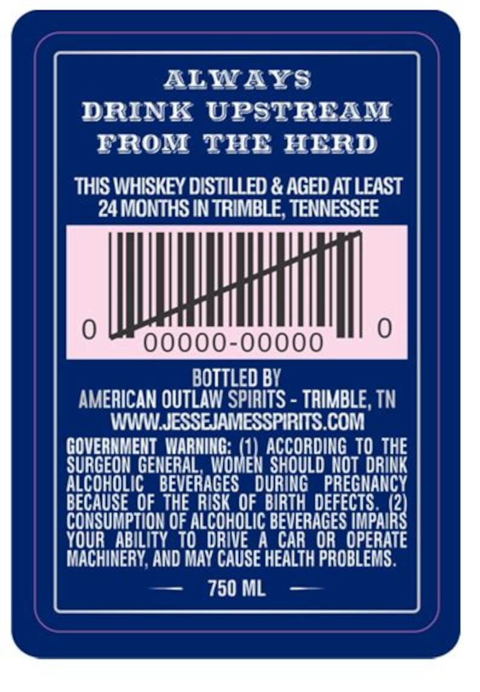
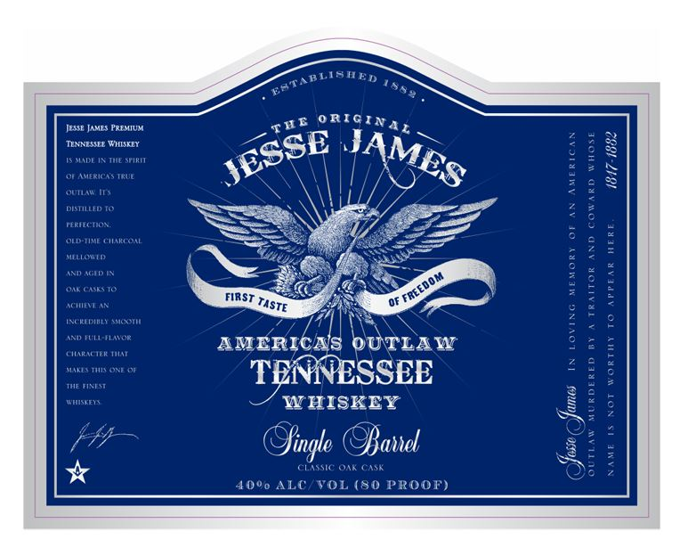

# TTB COLA Label Images - TTBID 26243001000250

**Brand Name:** JESSE JAMES

**Issue Date:** 09/08/2026

**Origin Code:** 43

**Product Class/Type:** 140

**Source:** [TTB Public COLA Registry](https://ttbonline.gov/colasonline/viewColaDetails.do?action=publicFormDisplay&ttbid=26243001000250)

## Label Images

### Back Label

### Front Label

### Label 3

## Extracted Label Text

*Text extracted via OCR - may contain errors*

*1 image(s) excluded: text did not meet readability threshold*

### Back Label

ALWAYS
DRINK UPSTREAM
FROM THE HERD
THIS WHISKEY DISTILLED & AGED AT LEAST
24 MONTHS IN TRIMBLE, TENNESSEE
0 Stl | 0
BOTTLED BY
AMERICAN OUTLAW SPIRITS - TRIMBLE, TN
WWW.JESSEJAMESSPIRITS.COM
GOVERNMENT rng Ad TO THE
SURGEON GENERAL, WOWEN SHOULD NOT DRINK
ALCOHOLIC BEVERAGES DURING PREGNANCY
BECAUSE OF THE RISK OF BIRTH DEFECTS. tt

CONSUMPTION OF ALCOHOLIC BEVERAGES IMPAI

YOUR ABILITY TO DRIVE A CAR OR OPERATE

MACHINERY, AND MAY CAUSE HEALTH PROBLEMS.
— 750ML —

### Front Label

JEsse JAMes PRfMIUN
ORIGINA_
TENNESSEE WHISKEX
DEI Tuc Snitn
W
Americas IRuE
Ou"
DBSTLLD T0
1
"lrienor
Old-Iivl Liiarl O^l
1
fLlcuin
Anu) auid In

Onr (AseS T0
FIRST
V
M itifm An
INg Riddibi } #Mgotii

Heinn etFa
AMERICAs OUTLAW
(iiaracilr Iiiat
ONE DE
TENVNESSEE
1
Heeeeni
Htenneee
W HISKEY
4
{
lingte @Ofanet
3
1
CLSSIC Ot Car
40"0 ALC
VOL (80 PRoor)
EATADLIPAED
T08%
T"I
JAMES
JESSE
OF FREEDOM
TaSTE
