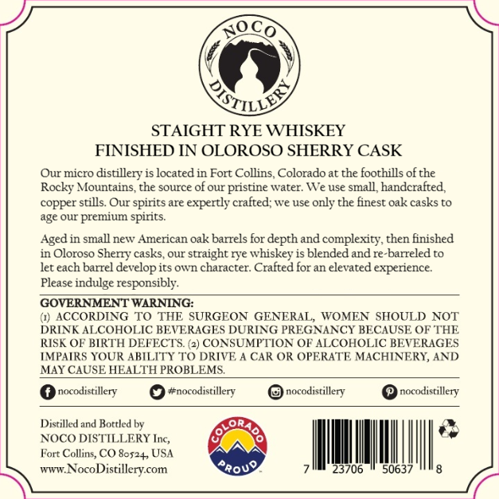
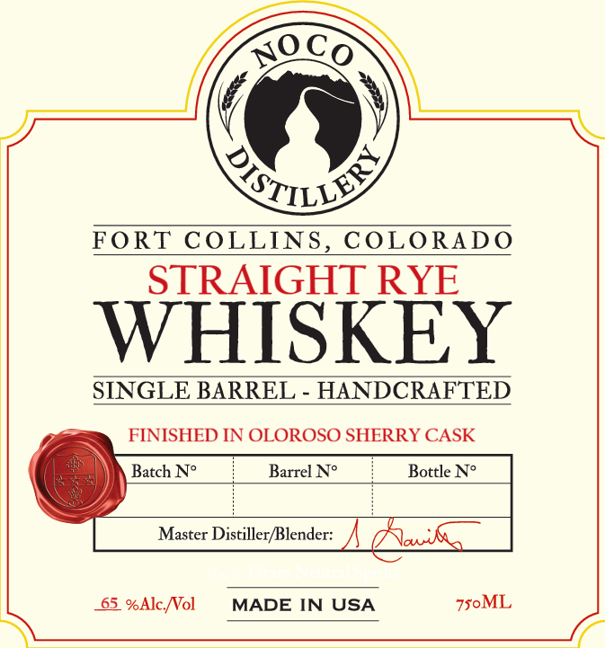

# TTB COLA Label Images - TTBID 26243001000256

**Brand Name:** NOCO DISTILLERY

**Issue Date:** 09/08/2026

**Origin Code:** 13

**Product Class/Type:** 102

**Source:** [TTB Public COLA Registry](https://ttbonline.gov/colasonline/viewColaDetails.do?action=publicFormDisplay&ttbid=26243001000256)

## Label Images

### Back Label

### Front Label

## Extracted Label Text

*Text extracted via OCR - may contain errors*

### Back Label

Co
STAIGHT RYE WHISKEY
FINISHED IN OLOROSO SHERRY CASK
Our micro
distillery is located in Fort Collins, Colorado at the foothills ofthe
Rocky Mountains,the source of our
pristine water: We use small, handcrafted,
copper stills Our spirits are expertly crafted; we use only the finest Oak casks to
age our premium spirits:
Aged in small new American Oak barrels for depth and complexity , then finished
in Oloroso Sheny casks, our straight rye whiskey is blended and re-barreled to
let each barrel develop its own character: Crafted for an elevated experience
Please indulge responsibly:
GOVERNMENT WARNING:
(1} ACCORDING
TO THE SURGEON
GENERAL, WOMEN SHOULD NOT
DRINK ALCOHOLIC BEVERAGES DURING PREGNANCY BECAUSE OF THE
RISK OF BIRTH DEFECTS (2) CONSUMFTION OF ALCOHOLIC BEVERAGES
IMPAIRS YOUR ABILITY TO DRIVE
CAR OR OPERATE MACHINERI, AND
MAY CAUSE HEALTH PROBLEMS
nocodistillery
#nocodistillery
nocodistillery
nocodistillery
Distilled and Bottled bv
NOCO DISTILLERY
Fort Collins, CO 8052+, USA
#TuZ
NocoDistillerycom
Rrouo
3706
5063
NO_
QILLEY
Tuc,

### Front Label

noCo
QILV
FORT COLLINS
COLORADO
STRAIGHT RYE
WHISKEY
SINGLE BARREL
HANDCRAFTED
FINISHED IN OLOROSO SHERRY CASK
Batch No
Barrel No
Bottle N?
Master Distiller/Blender:
MU

65_ %Alc Nol
MADE IN USA
750ML
