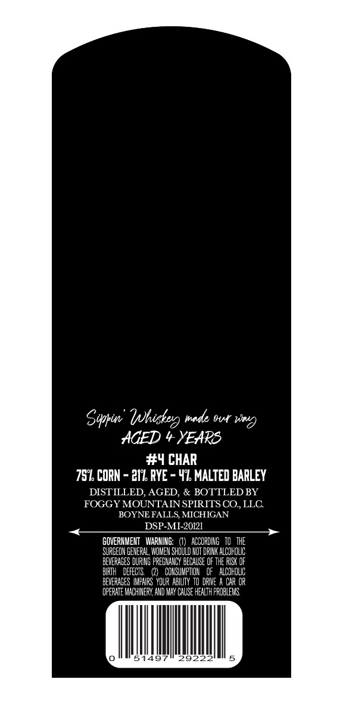
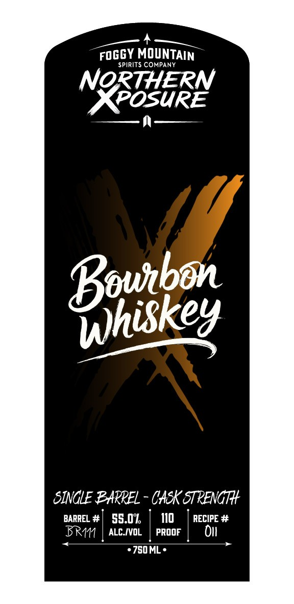

# TTB COLA Label Images - TTBID 26243001000316

**Brand Name:** NORTHERN XPOSURE BOURBON WHISKEY SINGLE BARREL

**Issue Date:** 09/08/2026

**Origin Code:** 06

**Product Class/Type:** 141

**Source:** [TTB Public COLA Registry](https://ttbonline.gov/colasonline/viewColaDetails.do?action=publicFormDisplay&ttbid=26243001000316)

## Label Images

### Back Label

### Front Label

## Extracted Label Text

*Text extracted via OCR - may contain errors*

**Detected Proof:** 110

### Back Label

Syptin'
made Br wnd)
HGED
YEAPS
#4 CHAR
759 CORN - 217 RYE
49 MALTED BARLEY
DISTILLED, AGED, & BOTTLED BY
FOGGY MOUNTAIN SPIRITS CO,LLC
BOYNE FALLS MICHIGAN
DSP-MI-20121
GOVERHMEHT   WARING:
ACCORDING   TO   THE
SUPGEON GENERAL;, VXOMEN SHould Hot DRIK ALCOHOLIC
BEVERHGES DURIG FREGNHHCY BECAUSE OF THE RISK OF
BIPIH   DEFECTES
COHSUKPTON   Of   alCoholic
BEVERHGES  IMFHIPS  YOUR ABLLIY to DRIE
Car OR
OPERHTE MACHIEPV, AVD WAY CAUSE HEaLlTH FROBLEHS
51497
29222
Ihiskea

### Front Label

roGGY MOUNTAIN

SPIRITS COMPANY

NORTHERN

NOB eERS

ff

euitbon

Bout

Wwherg

piskey

SINGLE BARREL - CASK STRENGHY

BARREL #

BRM

ALC.IVOL

55.0

|

PROOF

110

RECIPE #

I

780 ML
