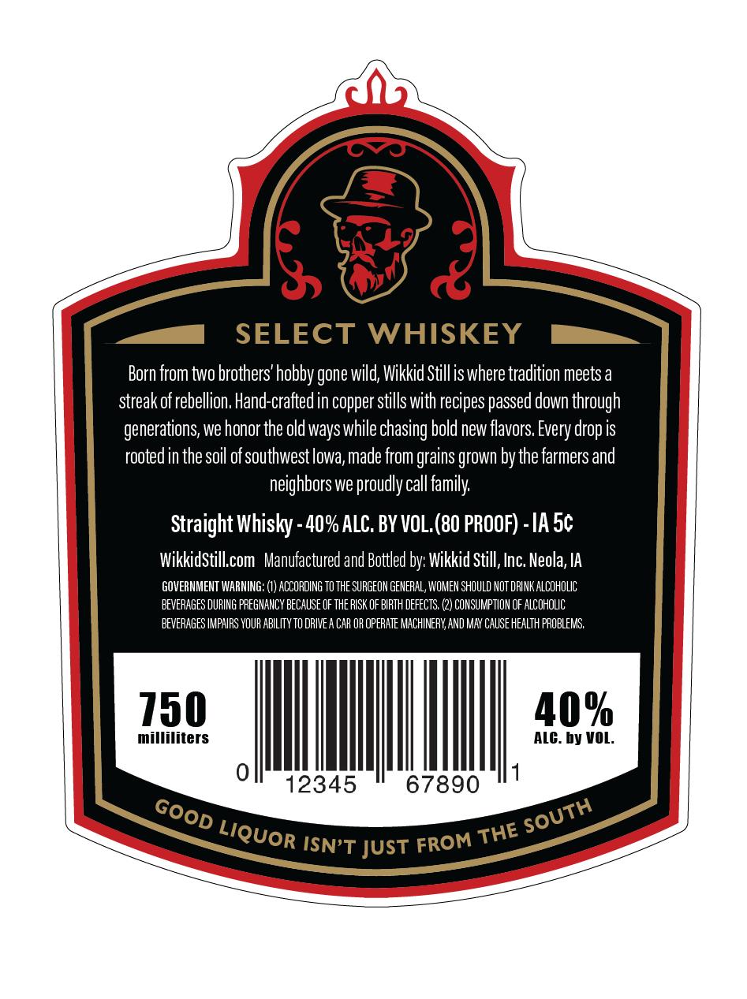
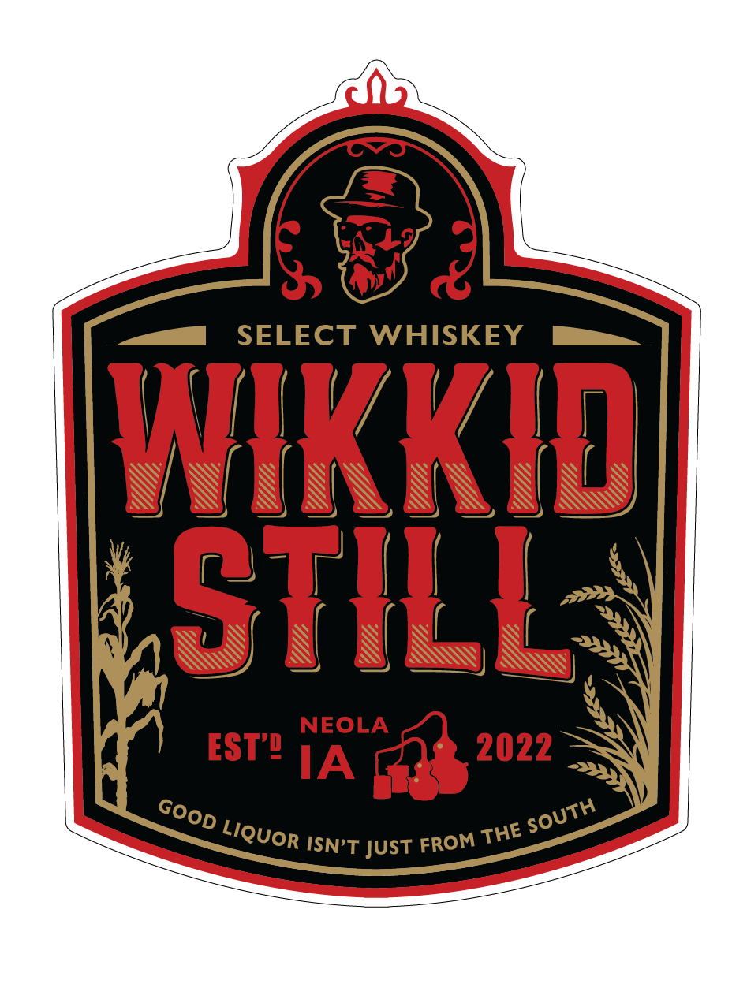
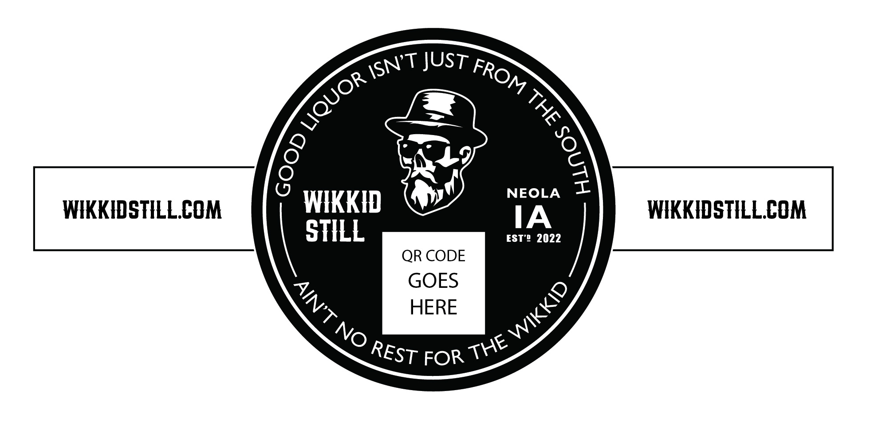

# TTB COLA Label Images - TTBID 26243001000385

**Brand Name:** WIKKID STILL

**Fanciful Name:** SELECT

**Issue Date:** 09/04/2026

**Origin Code:** 20

**Product Class/Type:** 140

**Source:** [TTB Public COLA Registry](https://ttbonline.gov/colasonline/viewColaDetails.do?action=publicFormDisplay&ttbid=26243001000385)

## Label Images

### Back Label

### Front Label

### Label 3

## Extracted Label Text

*Text extracted via OCR - may contain errors*

**Detected Proof:** 80

### Back Label

SELECT WHISKEY
Born from two brothers' hobby gone wild; Wikkid Stillis where tradition meets a
streak ofrebellion Hand-crafted in copper stills with recipes E
down through
generations; we honor the old ways while chasing bold new flavors Every drop is
rooted in the soil of southwest lowa, made from _
grown by the farmers and
neighbors we proudly call family
Straight
40% ALC. BY VOL (80 PROOF) -IA Sc
WikkidStillcom   Manufactured and Bottled by: Wikkid Still, Inc; Neola; IA
GOVERNMENT WARNING;:
ACCORDING To THE SURGEON GeNERAL, WOMEN SHOULD NOT DRINK ALCOHOLIC
beveRAGES DURING PREGHANCY BecauSE OF the RISK OF BIRTH DEFECTS;
CONSUMPTHON OF ALCOHOLIC
BEVERAGES IMPAIRS YOUR ABILITY To drIvea CAR OR operaTe MACHINERV,AND MaV Cause health PROBLEMS,
750
40%
milliliters
ALC. by VOL:
12345
67890
ISN'T JUST
passed
grains _
Whisky
SOUTH
GOOD
LIQUOR
THE
FROM

### Front Label

SELECT
WHISKEY
WkKID
STILL
NEOLA
EST" IA
2022
ISN'T JUST
SOuth
GOOD
LIQUOR
THE
FROM

### Label 3

JUST
NEOLA
WKKHDSTHLLCOM
WKKID
IA
WIKKHDSTILLCOM
STHLL
EST'! 2022
QR CODE
GOES
HERE
FOR
ISN'T
FROM
LIQUOR
4
3
8
WIKKID
AIN'T NO
THE
REST
