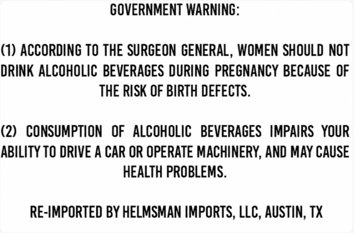
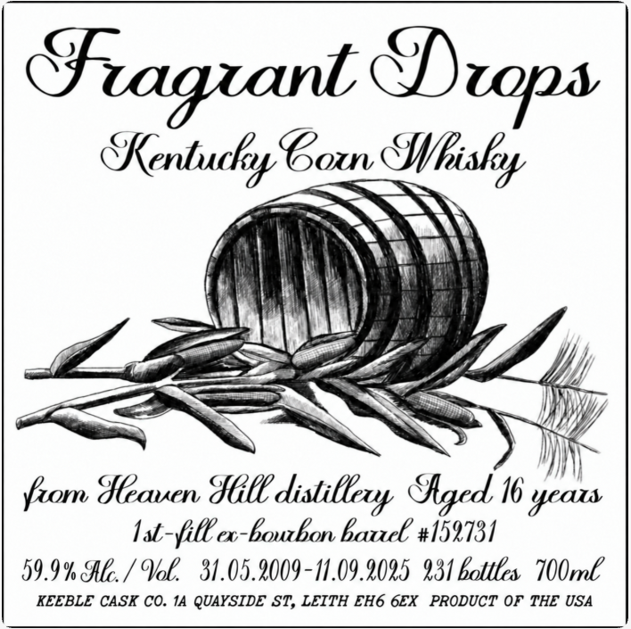

# TTB COLA Label Images - TTBID 26243001000537

**Brand Name:** FRAGRANT DROPS

**Fanciful Name:** HEAVEN HILL

**Issue Date:** 09/10/2026

**Origin Code:** 22

**Product Class/Type:** 143

**Source:** [TTB Public COLA Registry](https://ttbonline.gov/colasonline/viewColaDetails.do?action=publicFormDisplay&ttbid=26243001000537)

## Label Images

### Back Label

### Front Label

## Extracted Label Text

*Text extracted via OCR - may contain errors*

### Back Label

GOVERNMENT WARNING:
(1) ACCORDING TO THE SURGEON GENERAL, WOMEN SHOULD NOT
DRINK ALCOHOLIC  BEVERAGES DURING PREGNANCY BECAUSE OF
THE RISK OF BIRTH DEFECTS .
(2)
CONSUMPTION
OF   ALCOHOLIC   BEVERAGES  IMPAIRS   YOUR
ABILITY TO DRIVE A CAR OR OPERATE MACHINERY, AND MAY CAUSE
HEALTH PROBLEMS.
RE-IMPORTED BY HELMSMAN IMPORTS, LLC, AUSTIN, TX

### Front Label

SKentuchs yp eon Whi shy

: 4 ''))\\
from Heaven Fil distillery Aged 16 yeas
lat fill ca-bourhon barrel #159731
59.9% Ale. / Val. 31.05.2009- 11.09.2025 231 battles 700ml

KEEBLE CASK CO. 14 QUAYSIDE ST, LEITH EH6 6EX PRODUCT OF THE USA
