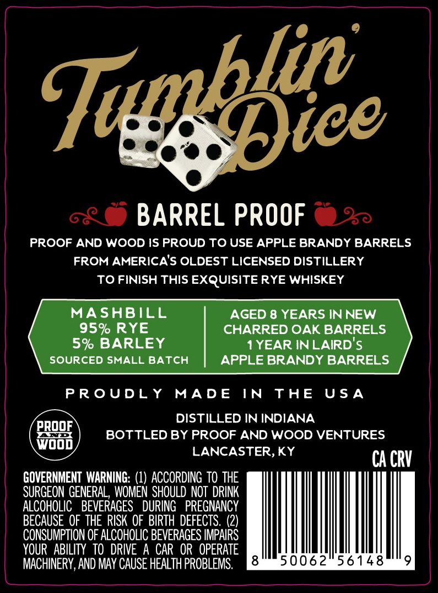
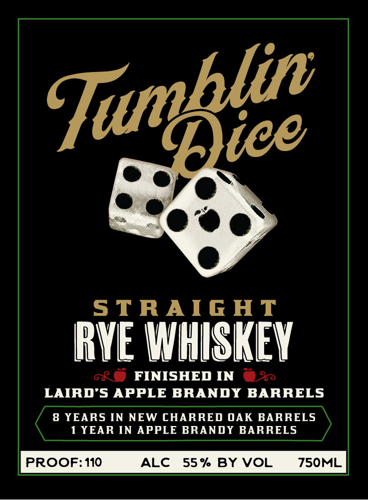

# TTB COLA Label Images - TTBID 26243001000617

**Brand Name:** TUMBLIN DICE

**Issue Date:** 09/04/2026

**Origin Code:** 22

**Product Class/Type:** 102

**Source:** [TTB Public COLA Registry](https://ttbonline.gov/colasonline/viewColaDetails.do?action=publicFormDisplay&ttbid=26243001000617)

## Label Images

### Back Label

### Front Label

## Extracted Label Text

*Text extracted via OCR - may contain errors*

**Detected Proof:** 110
**Detected Age:** 8 Years

### Back Label

vee

o<© BARREL PROOF > =

PROOF AND WOOD IS PROUD TO USE APPLE BRANDY BARRELS
FROM AMERICA'S OLDEST LICENSED DISTILLERY
TO FINISH THIS EXQUISITE RYE WHISKEY

MASHBILL AGED 8 YEARS IN NEW
95% RYE CHARRED OAK BARRELS

5% BARLEY 1 YEAR INLAIRD'S
SOURCED SMALL BATCH APPLE BRANDY BARRELS

PROUDLY MADE IN THE USA

PROOF DISTILLED IN INDIANA
aan BOTTLED BY PROOF AND WOOD VENTURES
LANCASTER, KY CA CRV

GOVERNMENT WARNING: (1) ACCORDING TO THE
SURGEON GENERAL, WOMEN SHOULD NOT DRINK
ALCOHOLIC BEVERAGES DURING PREGNANCY
BECAUSE OF THE RISK OF BIRTH DEFECTS. (2)
CONSUMPTION OF ALCOHOLIC BEVERAGES IMPAIRS
YOUR ABILITY TO DRIVE A CAR OR OPERATE
MACHINERY, AND MAY CAUSE HEALTH PROBLEMS.  RSAMMMIREOLOX<3-ae Xu eaeas

J

### Front Label

5TRAIGAT
RYE WHISKEY
FINISHED IN
LAIRD 5 APPLE BRANDY BARRELS
8 YEARS IN NEW CHARRED OAK BARRELS
1 YEAR IN
APPLE BRANDY BARRELS
PROOF:110
ALC
55 % BY VOL
750ML
Tumblie
