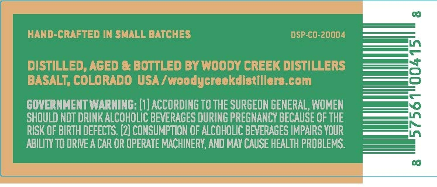
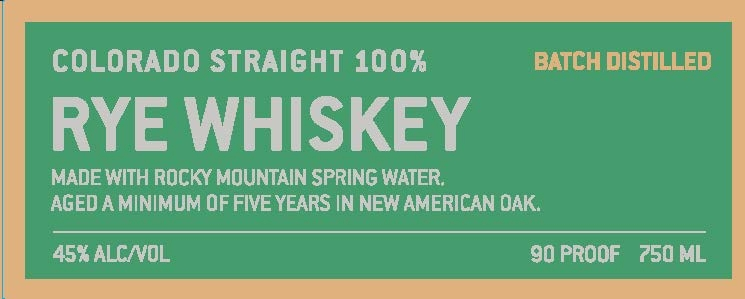

# TTB COLA Label Images - TTBID 26243001000640

**Brand Name:** WOODY CREEK DISTILLERS

**Issue Date:** 09/16/2026

**Origin Code:** 13

**Product Class/Type:** 102

**Source:** [TTB Public COLA Registry](https://ttbonline.gov/colasonline/viewColaDetails.do?action=publicFormDisplay&ttbid=26243001000640)

## Label Images

### Back Label

### Front Label

### Label 3

## Extracted Label Text

*Text extracted via OCR - may contain errors*

*1 image(s) excluded: text did not meet readability threshold*

**Detected Proof:** 90

### Back Label

HAND-CRAFTED IN SMALL BATCHES
DSP-CO-20004
DISTILLED,AGED & BOTTLED By WOOdy CREEK DISTILLERS
8
BASALT; COLORADO USA / woodycreokdistillors com
GOVERNMENT WARNING: (1] ACCORDING TO THE SURGEON GENERAL, WOMEN
SHOULD NOT DRINK ALCOHOLIC BEVERAGES DURING PREGNANCY BECAUSE OF THE
RISK OF BIRTH DEFECTS (2] CONSUMPTION OF ALCOHOLIC BEVERAGES IMPAIRS YOUR
K
ABILITY TO DRIVE A CAR DR OPERATE MACHINERY, AND MAY CAUSE HEALTH PRDBLEMS:

### Front Label

COLORADO STRAIGHT 100%
BATCH DISTILLED
RYE WHISKEY
MADE WITH ROCKY MOUNTAIN SPRING WATER;
AGEDA MINIMUM OF FIVE YEARS IN NEW AMERICAN DAK
45% ALCNOL
90 PROOF
750 ML
