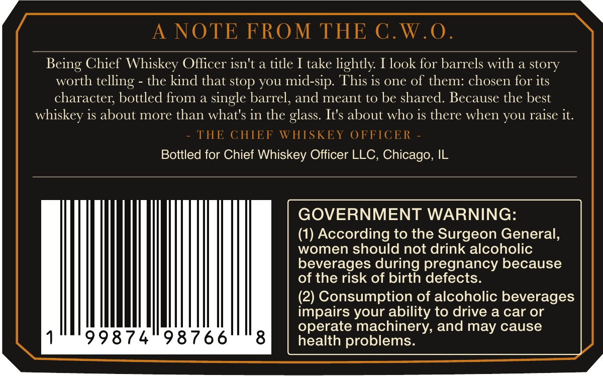
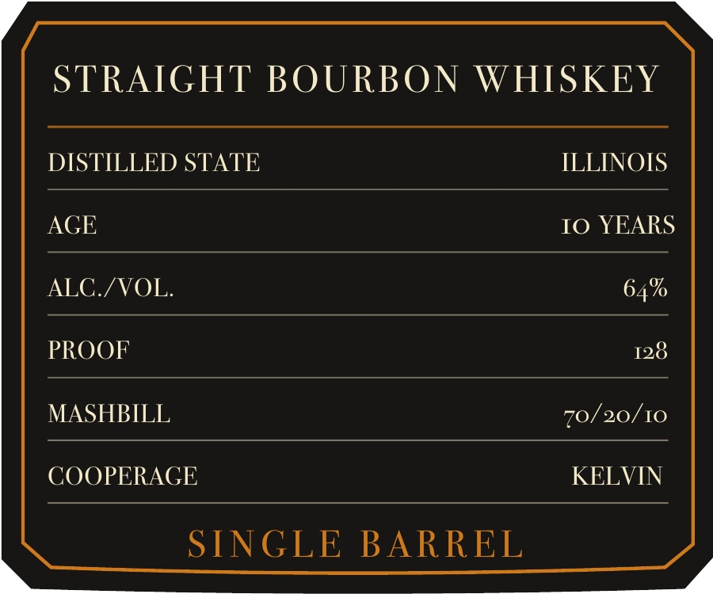

# TTB COLA Label Images - TTBID 26244001000002

**Brand Name:** CHIEF WHISKEY OFFICER

**Issue Date:** 09/08/2026

**Origin Code:** 04

**Product Class/Type:** 101

**Source:** [TTB Public COLA Registry](https://ttbonline.gov/colasonline/viewColaDetails.do?action=publicFormDisplay&ttbid=26244001000002)

## Label Images

### Back Label

### Front Label

## Extracted Label Text

*Text extracted via OCR - may contain errors*

**Detected Proof:** 128

### Back Label

NOTE FROM THE C.W.0 .
Chief Whiskey Oflicer isn't a title I take lightly Ilook for barrels with a story
worth telling -
the kind that stop you mid-sip. This is one of them: chosen for its
character; bottled from a single barrel, and meant to be shared. Because the best
whiskey is about more than what's in the glass. It's about who is there when YOu raise it.
THE CHIEF WHISKEY OFFICER
Bottled for Chief Whiskey Officer LLC , Chicago, IL
GOVERNMENT WARNING:
(1) According to the Surgeon General,
women should not drink alcoholic
beverages during pregnancy because
of the risk of birth defects:
(2) Consumption of alcoholic beverages
impairs your ability to drive a car or
operate machinery; and may cause
998 7 4
98766
8
health problems:
Being

### Front Label

STRAIGHT BOURBON WHISKEY
DISTILLED STATE
ILLINOIS
AGE
IO YEARS
ALC /VOL.
64%
PROOF
128
MASHBILL
70/20/10
COOPERAGE
KELVIN
SINGLE
BARREL
