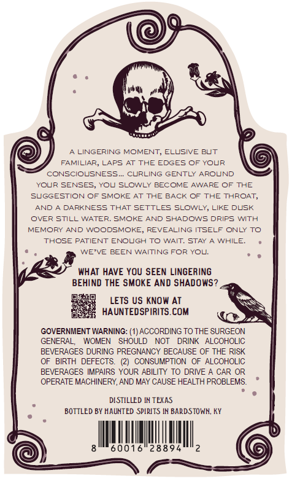
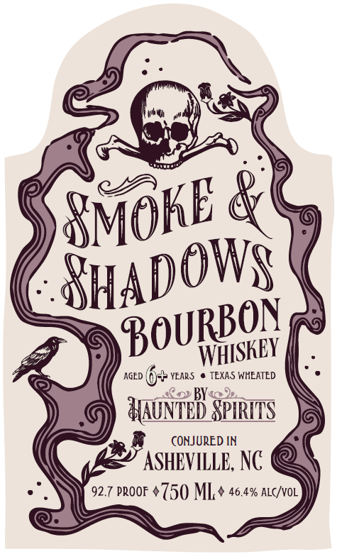

# TTB COLA Label Images - TTBID 26244001000055

**Brand Name:** SMOKE & SHADOWS

**Issue Date:** 09/21/2026

**Origin Code:** 22

**Product Class/Type:** 141

**Source:** [TTB Public COLA Registry](https://ttbonline.gov/colasonline/viewColaDetails.do?action=publicFormDisplay&ttbid=26244001000055)

## Label Images

### Back Label

### Label 1

## Extracted Label Text

*Text extracted via OCR - may contain errors*

**Detected Proof:** 92.7

### Back Label

LINGERING MOMENT, ELUSIVE
FAMILIAR, LAPS AT THE EDGES OF YOLR
CONSCIOUSNESS_
CLRLING GENTLY AROUND
YOLR SENSES
YOL SLOWLY BECOME AWARE OF THE
SUGGESTION OF SMOKE AT
THE BACK OF
THE THROAT,
AND
DARKNESS THAT SETTLES SLOWLY, LIKE DLSK
OVER STILL WATER: SMOKE AND SHADOWS DRIPS WITH
MEMORY AND WOODSMOKE; REVEALING ITSELF ONLY To
THOSE PATIENT ENOLGH To
WAIT: STAY
WHILE;
WE'VE BEEN WAITING FOR YOL:
WHAT HAVE YOU SEEN LINGERING
BEHIND THE SMOKE AND SHADOWS?
LETS US KNOW AT
HAUNTEDSPIRITS.COM
GOVERNMENT WARNING: (1) ACCORDING TO THE SURGEON
GENERAL;
WOMEN
SHOULD
NOT
DRINK
ALCOHOLIC
BEVERAGES DURING PREGNANCY BECAUSE OF THE RISK
OF   BIRTH DEFECTS:
CONSUMPTION
OF ALCOHOLIC
BEVERAGES IMPAIRS YOUR ABILITY TO DRIVE A CAR
OPERATE MACHINERY, AND MAY CAUSE HEALTH PROBLEMS
DISTILLED IN TEXAS
BOTTLED BY HAUNTED SPLRITS IN BARDSTOWN; KY
60016"28894
BUT

### Label 1

AGED
14P YEARS
TEXAS WHEATED
BHc 2
HAUnHEd SpIRIS
CONJURED IN
ASHEVILLE, NC
92.7 PROOF $750 ML + 46.4% ALc/vOL
SMoKE
ShadowS
BOURBon
WHISKEY
