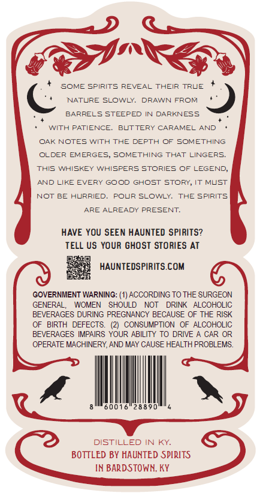
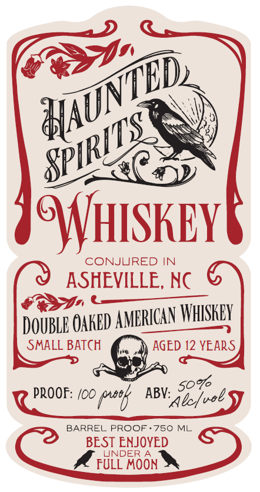

# TTB COLA Label Images - TTBID 26244001000059

**Brand Name:** HAUNTED SPIRITS

**Issue Date:** 09/15/2026

**Origin Code:** 22

**Product Class/Type:** 140

**Source:** [TTB Public COLA Registry](https://ttbonline.gov/colasonline/viewColaDetails.do?action=publicFormDisplay&ttbid=26244001000059)

## Label Images

### Back Label

### Label 1

## Extracted Label Text

*Text extracted via OCR - may contain errors*

**Detected Age:** 12 Years

### Back Label

SOME SPIRITS REVEAL THEIR
TRVE
NATURE SLOWLY.
DRAWN FROM
BARRELS STEEPED IN DARKNESS
WITH PATIENCE:
BUTTERY CARAMEL AND
OAK NOTES WITh THE DEPTH OF SOMETHING
OLDER EMERGES
SOMETHING THAT LINGERS.
ThIs WHISKEY WHISPERS STORIES OF LEGEND;
AND
EVERY GOOD GHOST STORY,
MLST
NOT BE HURRIED;
POLR SLOWLY.
THE Spirits
ARE ALREADY PRESENT;
HAVE YOU SEEN HAUNTED SPIRITS?
TELL US YOUR GHOST STORIES AT
HAUNTEDSPIRITS.COM
GOVERNMENT WARNING: (1) ACCORDING TO THE SURGEON
GENERAL;
WOMEN
SHOULD
NOT
DRINK   ALCOHOLIC
BEVERAGES DURING PREGNANCY BECAUSE OF THE RISK
BIRTH
DEFECTS
CONSUMPTION  OF ALCOHOLIC
BEVERAGES IMPAIRS YOUR ABILITY TO DRIVE 4 CAR
OPERATE MACHINERY,AND MAY CAUSE HEALTH PROBLEMS:
60016
288 95
DISTILLED IN KY
BOTTLED BY HAUNTED SPIRITS
IN BARDSTOWN; KY
LIkE

### Label 1

GYHISKEY_
cONJURED IN
ASHEVILLE, NC
DOUBLE OakEd AMERIGAV WHSKEY
SMALL BATCH
AGED 12 YEARS
5o%
PROOF: /00 (tk
ABV:
BARREL FROOF
750 ML
BEST ENJOYED
UNDER
FULL
EOoN "
MAUNTBC
SPIRHTS
bc/uol
