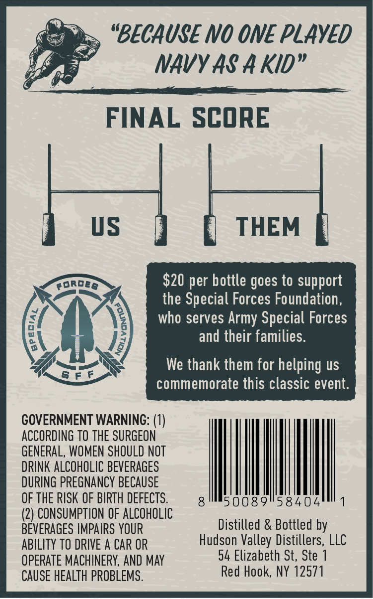
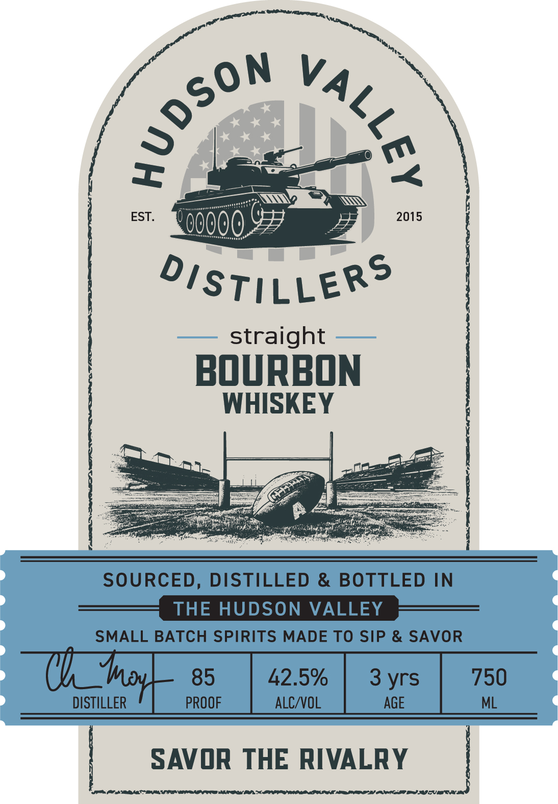

# TTB COLA Label Images - TTBID 26244001000067

**Brand Name:** HUDSON VALLEY DISTILLERS

**Issue Date:** 09/04/2026

**Origin Code:** 02

**Product Class/Type:** 101

**Source:** [TTB Public COLA Registry](https://ttbonline.gov/colasonline/viewColaDetails.do?action=publicFormDisplay&ttbid=26244001000067)

## Label Images

### Back Label

### Front Label

## Extracted Label Text

*Text extracted via OCR - may contain errors*

### Back Label

"BECAUSE No ONE PLAYED
NAVY AS A Kid"
FINAL SCORE
vS
THEM
porpe
S20 per bottle goes to support
the Special Forces Foundation ,
who serves Army Special Forces
)
and their families:
We thank them for helping uS
commemorate this classic event.
GOVERNMENT WARNING: (1)
ACCORDING TO THE SURGEON
GENERAL, WOMEN SHOULD NOT
DRINK ALCOHOLIC BEVERAGES
DURING PREGNANCY BECAUSE
OF THE RISK OF BIRTH DEFECTS.
50089
58404
(2) CONSUMPTION OF ALCOHOLIC
BEVERAGES IMPAIRS YOUR
Distilled & Bottled by
ABILITY TO DRIVE A CAR OR
Hudson Valley Distillers, LLC
OPERATE MACHINERY, AND May
54 Elizabeth St, Ste
CAUSE HEALTH PROBLEMS.
Red Hook, NY 12571

### Front Label

BOURBON
WHISKEY

straight

SOURCED, DISTILLED & BOTTLED IN
THE HUDSON VALLEY
thn BATCH SPIRITS MADE TO SIP & SAVOR

aay PROOF ALC/VOL AGE

™ SAVOR THE RIVALRY 7

IPI ah RRS EPS ARI OP OTN TOL SLR ON ALE PD IOI TI OEE
