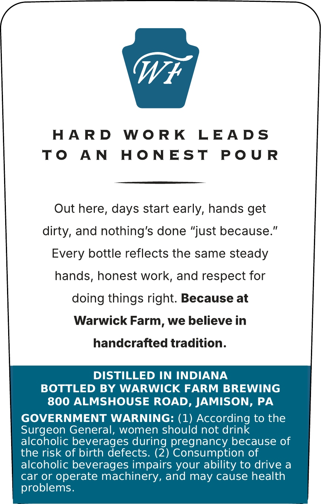
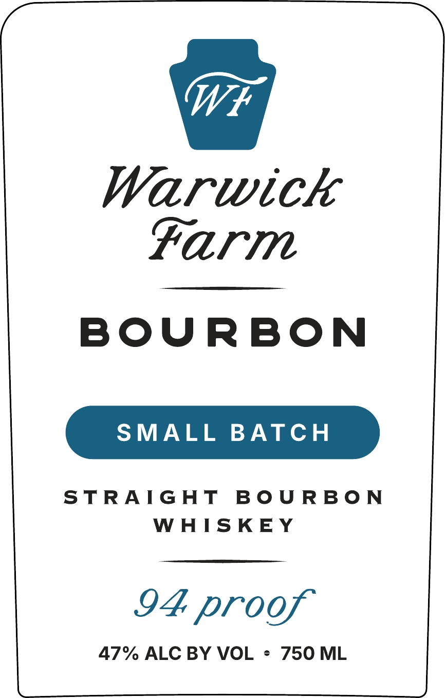

# TTB COLA Label Images - TTBID 26244001000094

**Brand Name:** WARWICK FARM STRAIGHT BOURBON WHISKEY

**Fanciful Name:** SMALL BATCH

**Issue Date:** 09/04/2026

**Origin Code:** 39

**Product Class/Type:** 101

**Source:** [TTB Public COLA Registry](https://ttbonline.gov/colasonline/viewColaDetails.do?action=publicFormDisplay&ttbid=26244001000094)

## Label Images

### Back Label

### Front Label

## Extracted Label Text

*Text extracted via OCR - may contain errors*

**Detected Proof:** 94

### Back Label

HARD WORK LEADS

TO AN HONEST POUR

Out here, days start early, hands get

dirty, and nothing's done “just because.”

Every bottle reflects the same steady

hands, honest work, and respect for

doing things right. Because at

Warwick Farm, we believe in

handcrafted tradition.

DISTILLED IN INDIANA

BOTTLED BY WARWICK FARM BREWING

800 ALMSHOUSE ROAD, JAMISON, PA

GOVERNMENT WARNING: (1) According to the

Surgeon General, women should not drink

alcoholic beverages during pregnancy because of

the risk of birth defects. (2) Consumption of

alcoholic beverages impairs your ability to drive a

car or operate machinery, and may cause health

problems.

### Front Label

Warwick
Farm

BOURBON

SMALL BATCH

STRAIGHT BOURBON
WHISKEY

I4 proof

47% ALC BY VOL = 750 ML
