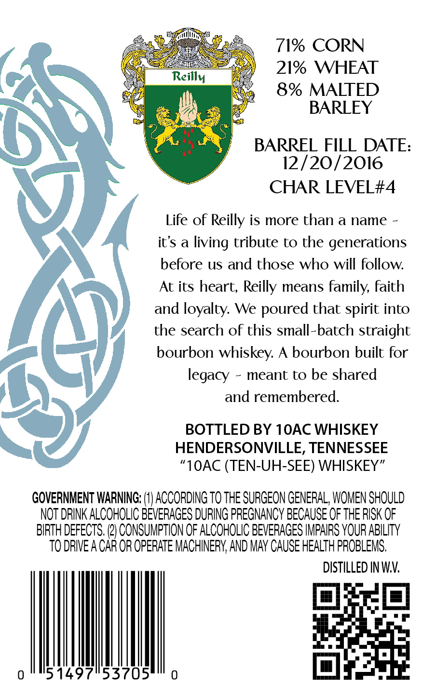
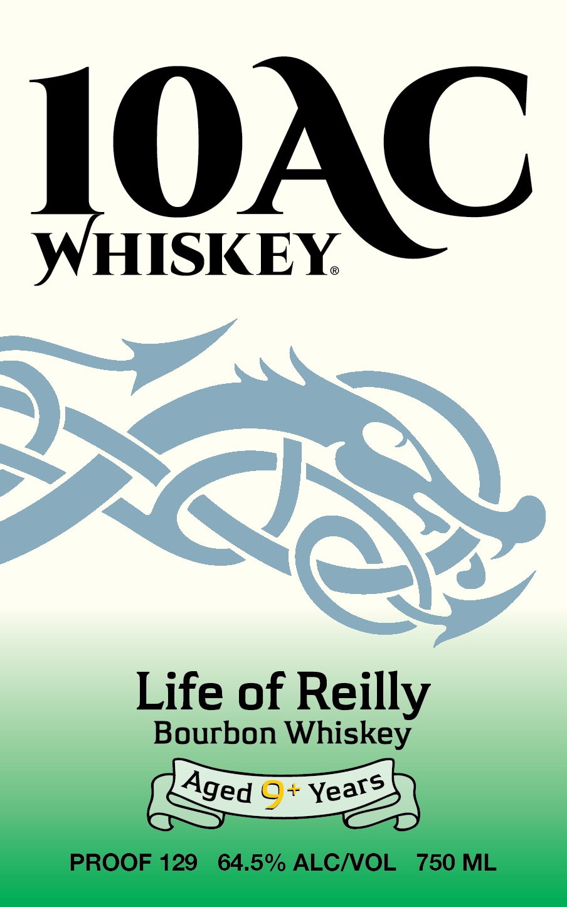

# TTB COLA Label Images - TTBID 26244001000135

**Brand Name:** 10AC WHISKEY

**Issue Date:** 09/09/2026

**Origin Code:** 43

**Product Class/Type:** 101

**Source:** [TTB Public COLA Registry](https://ttbonline.gov/colasonline/viewColaDetails.do?action=publicFormDisplay&ttbid=26244001000135)

## Label Images

### Back Label

### Front Label

## Extracted Label Text

*Text extracted via OCR - may contain errors*

**Detected Proof:** 129

### Back Label

71% CORN
21% WHEAT
Reillv
8% MALTED
BARLEY
0
BARREZGIZOTE:
CHAR LEVEL#4
Life of
is more than a name
it's a living tribute to the generations
before us and those who will follow
At its heart;
means family, faith
and loyalty: We poured that spirit into
the search of this small-batch straight
bourbon whiskey: A bourbon built for
legacy
meant to be shared
and remembered:
BOTTLED BY 1OAC WHISKEY
HENDERSONVILLE, TENNESSEE
"1OAC (TEN-UH-SEE) WHISKEY"
GOVERNMENT WARNING;
ACCORDING TO THE SURGEON GENERAL, WOMEN SHOULD
NOT DRINK ALCOHOLIC BEVERAGES DURING PREGNANCY BECAuSE OF THE RISK OF
BIRTH DEFECTS. (2} CONSUMPTION OF ALCOHOLIC BEVERAGES IMPAIRS YOUR ABILITY
TO DRIVE A CAR OR OPERATE MACHINERY; AND MAv CAUSE HEALTH PROBLEMS;
DISTILLED IN WV:
0
514971153705
Reilly
Reilly

### Front Label

IOAC
WHISKEY
>
Life of Reilly
Bourbon Whiskey
0+
PROOF 129
64.5% ALCNOL
750 ML
Qex
Aged
Years
