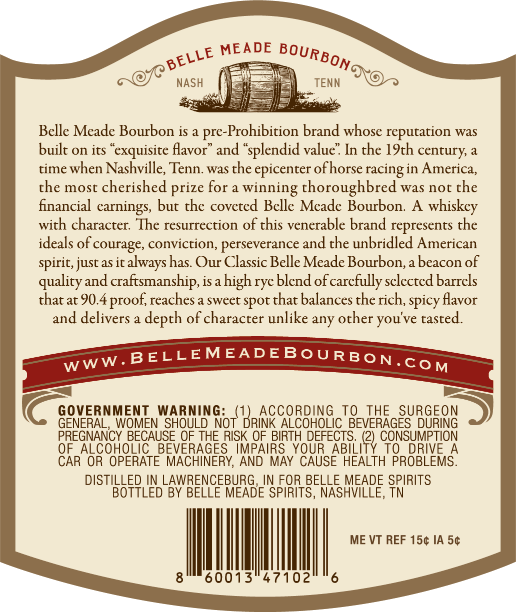
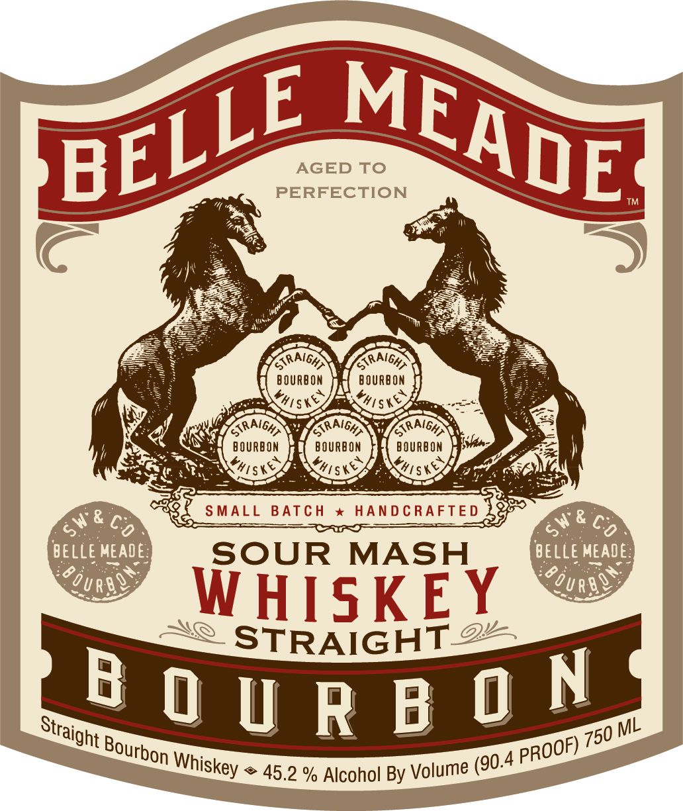
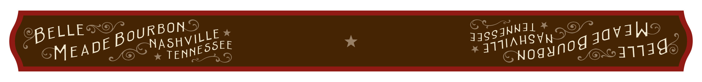

# TTB COLA Label Images - TTBID 26244001000177

**Brand Name:** BELLE MEADE BOURBON

**Issue Date:** 09/09/2026

**Origin Code:** 43

**Product Class/Type:** 101

**Source:** [TTB Public COLA Registry](https://ttbonline.gov/colasonline/viewColaDetails.do?action=publicFormDisplay&ttbid=26244001000177)

## Label Images

### Back Label

### Front Label

### Label 3

## Extracted Label Text

*Text extracted via OCR - may contain errors*

**Detected Proof:** 90.4

### Back Label

MEADE
NASH
TENN
Belle Meade Bourbon is a
pre-Prohibition brand whose reputation was
built on its "exquisite flavor"
and "splendid value" In the 19th century a
time when Nashville; Tenn: was the epicenter ofhorse racing in America,
the most cherished
for a
winning thoroughbred was not the
financial earnings, but the coveted Belle Meade Bourbon.
A
whiskey
with character: The resurrection of this venerable brand represents the
ideals of courage, conviction, perseverance and the unbridled American
spirit; just as it always has Our Classic Belle Meade Bourbon,a beacon of
quality and craftsmanship, isa high rye blend of carefully selected barrels
that at 90.4 proof,reaches a sweet spot that balances the rich; spicy flavor
and delivers a depth of character unlike any other you've tasted.
BELLEMEADEBoU RBON.co M
GOVERNMENT
WARNING:
K{BRICCQEOHOG
To
THE
SURGEON
GENERAL, WOMEN SHOULD NOT"
ALCOHOLIC_ BEVERAGES DURING
PREGNANCY BECAUSE QF THE RISK OF, BIRTH DEFECTS:.  (2) , CONSUMPTION
OF ALCOHOLIC
BEVERAGES IMPAIRS YOUR ABILITY
ToDRIVE A
CAR OR OPERATE MACHINERY, AND MAY CAUSE HEALTH PROBLEMS.
DISTILLED IN LAWRENCEBURG, IN FOR BELLE MEADE SPIRITS
BOTTLED BY BELLE MEADE SPIRITS, NASHVILLE, TN
ME VT REF 150 IA 50
8 '
60013"47102
6
BOURBONc
BELLE
prize
WWW _

### Front Label

AGED To
PERFECTION
1e
O8
SRAiGHA
TRAIGHA
9 OURbOM
9 OURbOn
Yh|ske
GRAIGHA
GRAiGHA
TaRAiGAA
B OURBON
BOURBOM
BOURBON
Y#tske
YhIsky
hisks
&
SMALL
BATC H
HANDCRAFTE D
&
M
c6
4
co
BELLE MEADE
SOUR
MASH
BELLe MEADE:
Urbo
URb@
WHISKEY
STRAIGHT 9
B 0 U R B 0 N
ML
45.2 % Alcohol By Volume
MEADE
BELLE
Yhis)
SKeY
Straight !
750
Bourbon "
PROOF)
(90.4
Whiskey

### Label 3

BELLE RBON
MEADE pou asnvitte
ies 34gg4NNGG
Sa AHSVN nod java
yoy qqiag
