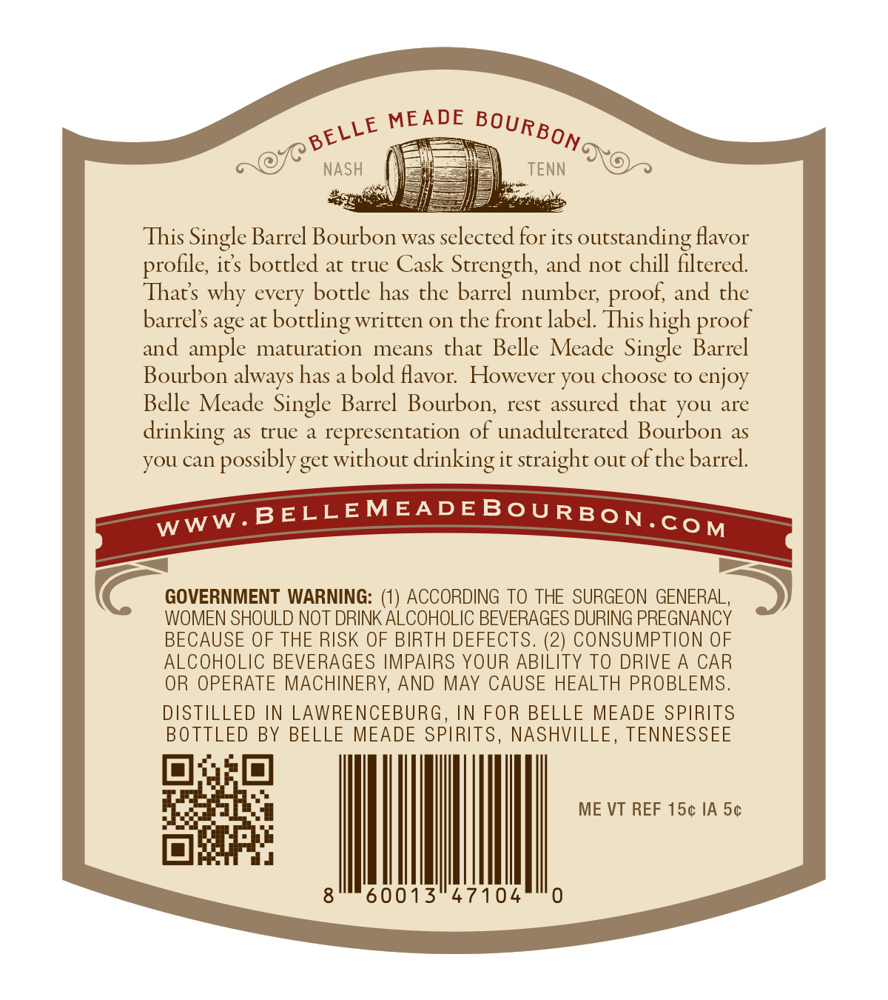
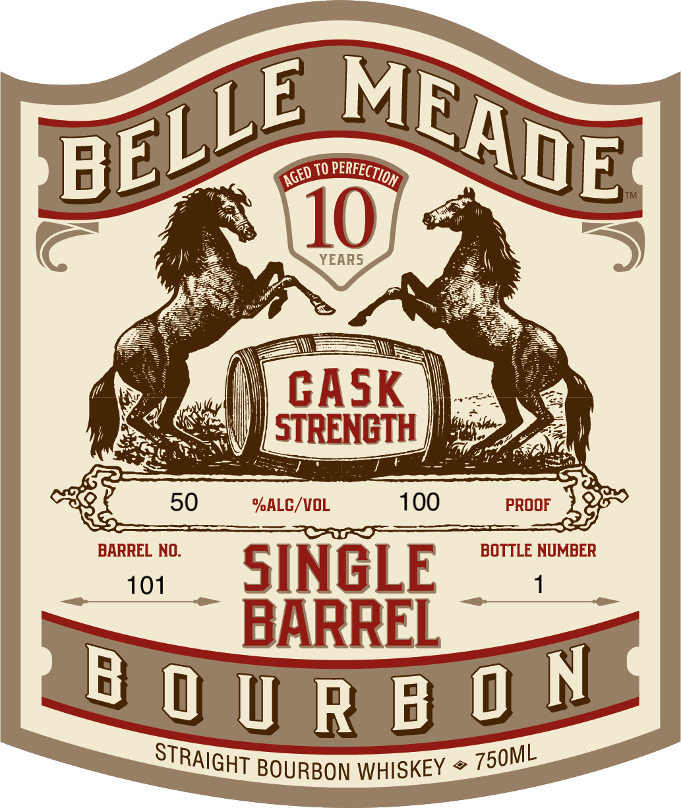
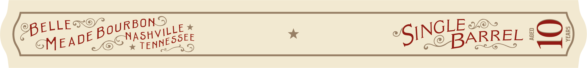

# TTB COLA Label Images - TTBID 26244001000212

**Brand Name:** BELLE MEADE

**Fanciful Name:** SINGLE BARREL

**Issue Date:** 09/09/2026

**Origin Code:** 43

**Product Class/Type:** 101

**Source:** [TTB Public COLA Registry](https://ttbonline.gov/colasonline/viewColaDetails.do?action=publicFormDisplay&ttbid=26244001000212)

## Label Images

### Back Label

### Front Label

### Label 3

## Extracted Label Text

*Text extracted via OCR - may contain errors*

**Detected Proof:** 100
**Detected Age:** 10 Years

### Back Label

MEADE
NASH
TENN
This Single Barrel Bourbon was selected for its_
outstanding Havor
profile; ics boctled at true Cask Strength, and noc chill filtered
Thats why every bottle has the barrel number; proof; and the
barrels age at
boccling written on the front label. This high
and ample maturation
means that Belle Meade Single Barrel
Bourbon always has a bold Aavor:  However you choose to enjoy
Belle Meade Single Barrel  Bourbon, rest assured that you are
drinking
as
true a
representation of unadulterated Bourbon as
you can possiblyget without drinking it straight out of the barrel.
BELLEMEADEBoURBON.CoM
GOVERNMENT WARNING:
ACCORDING TO THE SURGEON GENERAL,
WOMEN SHOULD NOT DRINK ALCOHOLIC BEVERAGES DURING PREGNANCY
BECAUSE OF THE RISK OF BIRTH DEFECTS. (2) CONSUMPTION OF
ALCOHOLIC BEVERAGES IMPAIRS YOUR ABILITY TO DRIVE A
CAR
OR OPERATE MACHINERY, AND MAY CAUSE HEALTH PROBLEMS.
DISTILLED IN LAWRENCEBURG , IN FOR BELLE MEADE SPIRITS
BOTTLED BY BELLE MEADE SPIRITS ,
NASHVILLE ,
TENNESSEE
ME VT REF 15c IA 5c
8
60013
47104
0
BOURBON
BELLE
proof
WwW _
(1)

### Front Label

TO
10
YEARS
GASK
STRENGTH
50
%ALC/VOL
100
PROOF
BARREL NO.
BOTTLE NUMBER
101
SINGLE
BARREL
B 0 U R B 0 N
BOURBON WHISKEY
MEADE
BELLE
PERFECTION /
AGED =
STRAIGHT
750ML

### Label 3

ELLE

ouR

BO

Ele ts

GLE

FAD

* TEN

ASHV!

pooEe

ARREL
