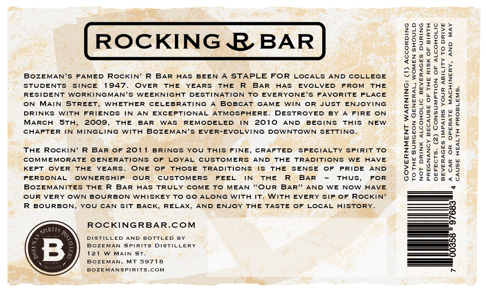
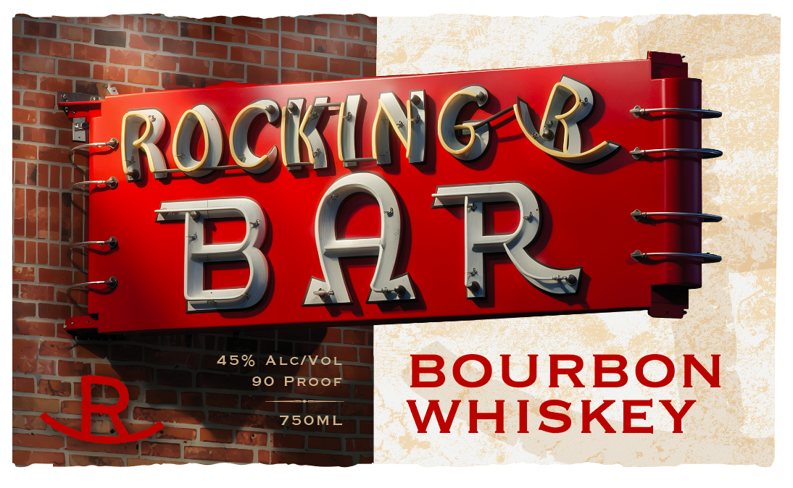

# TTB COLA Label Images - TTBID 26244001000277

**Brand Name:** ROCKING R BAR BOURBON WHISKEY

**Issue Date:** 09/10/2026

**Origin Code:** 30

**Product Class/Type:** 141

**Source:** [TTB Public COLA Registry](https://ttbonline.gov/colasonline/viewColaDetails.do?action=publicFormDisplay&ttbid=26244001000277)

## Label Images

### Back Label

### Front Label

## Extracted Label Text

*Text extracted via OCR - may contain errors*

**Detected Proof:** 90

### Back Label

ROCKING R BAR
IH
6
J
V
2
8
2 %
BozEMANs
FAMED
RocKIN=
BAR
HAS
BEEN
A STAPLE FOR
LOCALs
AND
COLLEGE
2
8
28
1
STUDENTS
SINCE
1947
OVER
TAE
YEARS
THE
BAR
HAS
EVOLVED
FROM
THE
1
4
1
RESIDENT
WORKINGMAN'5
WEEKNIGHT
DESTINATION
To
EVERYONE's
FAVORITE
PLACE
1
6
8
1
ON
MAIN STREET
WHETHER
CELEBRATING
BoBcAT
GAME
WIN
OR
JUST
ENJOYING
1
1
DRINKS
WITH
FRIENDS
IN
AN
EXCEPTIONAL
ATMOSPHEREJ
DESTROYED
BY
FIRE
ON
3
1
MARCH
5th_
2009,
THE
BAR
WAS
REMODELED
IN
2010
AND
BEGINS
ThIS
NEW
3
WM
CHAPTER
IN
MINGLING
WITH
BozEMAN'S EVER-EVOLVING
DOWNTOWN
SETTING
5
THE
RocKIN'
BAR
OF 201
BRINGS
YOU ThIS
FINE;
CRAFTED
SPECIALTY
SPIRIT
To
i
1
8
3
COMMEMORATE
GENERATIONS
OF
LOYAL
CUSTOMERS
AND
THE
TRADITIONS
WE
HAVE
1
#
M
3
KEPT
OVER
THE
YEARS
ONE
OF
THOSE
TRADITIONS
15
THE
SENSE
OF
PRIDE
AND
;
PERSONAL
OWNERSIP
OUR
CUSTOMERS
FEEL
IN
THE
BAR
THUS,
FOR
9
BozEMANITES
THE R
BAR
HAS
TRULY COME
To
MEAN
{OUR
BAR" AND
WE
Now HAVE
OUR
VERY
OWN
BOURBON
WHISKEY To
Go ALONG
WITH
IT_
WITH
EVERY
SIP
OF
RocKIN'
BOURBON,
YOU
CAN
SIT
BACK
RELAX,
AND
ENJOY THE TASTE
OF LOCAL
HISTORY_
RoCKINGRBAR.COM
Snklity
DISTILLED
AND
BOTTLED
BY
BozEMAN
SPIRITS
DISTILLERY
8
12 1
MAIN St_
BozEMAN
MT 59718
BozEMANSPIRITS.COM
1

### Front Label

ROcKiNG 6
BAR
2
45%
ALcivol
90
PRooF
BOURBON
750ML
WHISKEY
592
