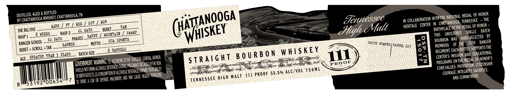
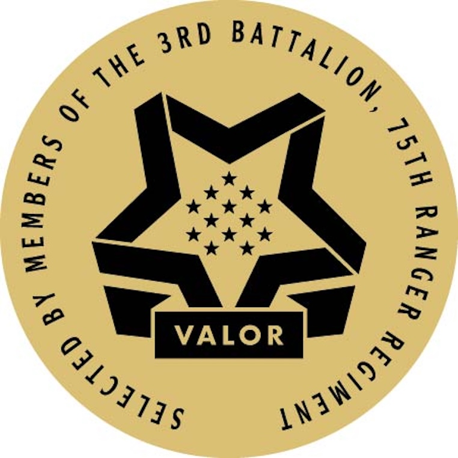

# TTB COLA Label Images - TTBID 26244001000346

**Brand Name:** CHATTANOOGA WHISKEY

**Fanciful Name:** RANGER

**Issue Date:** 09/10/2026

**Origin Code:** 43

**Product Class/Type:** 101

**Source:** [TTB Public COLA Registry](https://ttbonline.gov/colasonline/viewColaDetails.do?action=publicFormDisplay&ttbid=26244001000346)

## Label Images

### Label 1

### Label 2

### Label 3

## Extracted Label Text

*Text extracted via OCR - may contain errors*

*1 image(s) excluded: text did not meet readability threshold*

**Detected Proof:** 111

### Label 1

DISTHLLED AGeD & BOISREP CHATTanooga TN
NATIONAL MEDAL of hoNoR
BY
'Chattanooga WhISKEY;
MOB
Tennessee
IN
COLLABORATION WITH tHE
TENNESSEE
THE
PT
MED
TAN
GENer M GPLacEosghe MEDESoF Honor e
THE BIG
WEEKS
RASP 2
21 DAYS
BERET
SWAMP
Jtigh <
Bnghp LGFofre )
BATCH
RASP 1
8
WOUETAIN
THIS
HAND-SELEcTEd   BY
SCHOOL
62 DAys
SUA SPONTE
BOURBON   WAS
RANGER
RANGER :
EARNED
MOTto
BAICH XJXBBR | BARRSL LOT
uU
MEMBERS   OF THE
75Th
BERET + SCROLL + TAB
8
BARRELS
W H|sKEY
7
REGhMENT EAch BoTtLE SUPpoRTGTHE
GRBAQBR_TEAY 3 _YBARS
BATCH SIZE
B 0 U R B 0 N
reGTers wSSion AND EDucationas
AGE
Warhhg; 0 Kcorohctte SRIUN GHEROFTHVEK
S T RA/GHT
keop mgoelh oenatty ave' DFuecatye
F
2
frograns OnThe Medal oe Honorip
GOVERHHEHT '
cbarrgSwrnge owcyRechs oterT
"hatk J hadlrrg cemrades / gakdtswntdecp noree{hons mg share %1 #e
EVALUEs: PATRIotISM; CTIZENSHIP
SHQUD woTdrMk acohouce
falcoHoicbzerigesmpns HURABETY
(Never=
and
(morally
3 will <
% ALC/VOL
CORE'
INTEGRITV, SAcRIFICE,
OfBRTHdeFECTS C
OF
HN chuSe heauh ProbleV
strong
HIGH MALT
111 PROOF 55.50
couRAGE,
[3192100654
10 Drwe A (ar OR OperATe
AND
TENNESSEE
AND
8
HATzANOOGA
SUT
Male
HERITAGE
WHISKEY
MARK
FIVE
SINGLE
DARBY
PHASES
111
PROOF
and _
75 0 ML
straight
)CONSUMPTONC
COMMITMENT;
MACHNERN

### Label 2

essee &Tign Ua
dennessee &ign (aUt
dernessee
Ufign dvaui
genne
CooLidge NATIONAL
h MEDALoutessee Zhigh cMale
Is ehigh cMale Tennessee_
d
"eHONOR
heritAGE Center
Malt Tennessee &PR0 0 Fale Tennessee Ztigh cMa
VAioR
Ie
4 Ma/
26kk38oo
4kMak 4228s
4kMak 44288>
4nE/
