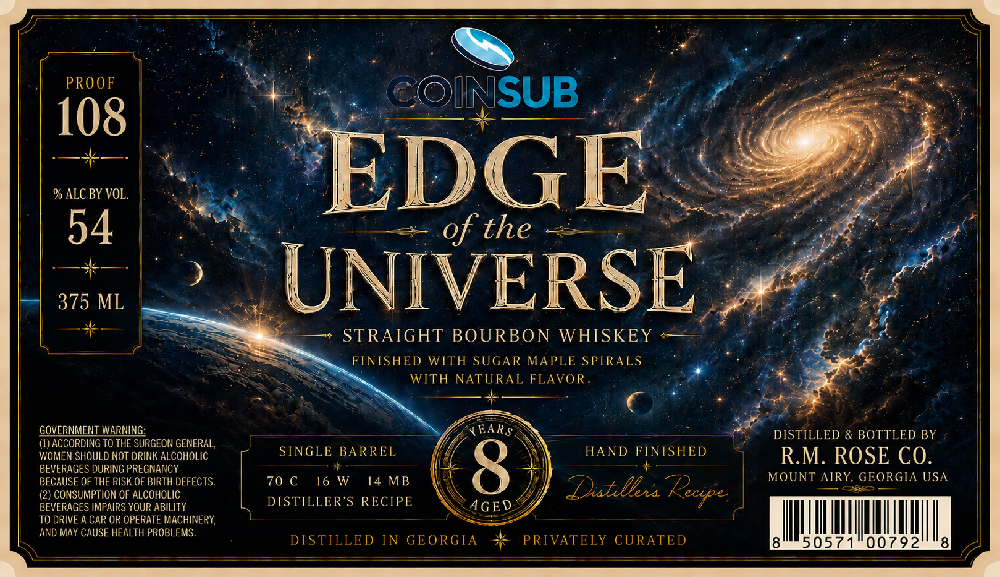

# TTB COLA Label Images - TTBID 26244001000356

**Brand Name:** EDGE OF THE UNIVERSE

**Fanciful Name:** SINGLE BARREL

**Issue Date:** 09/22/2026

**Origin Code:** 08

**Product Class/Type:** 146

**Source:** [TTB Public COLA Registry](https://ttbonline.gov/colasonline/viewColaDetails.do?action=publicFormDisplay&ttbid=26244001000356)

## Label Images

### Label 1

## Extracted Label Text

*Text extracted via OCR - may contain errors*

### Label 1

PRO OF
COINSUB
108
% ALC BY VOL.
EDGE
54
of the
375 ML
UNIVERSE
STRAIGHT BOURBON WHISKEY
FINISHED
WITH SUGAR MAPLE SPIRALS
WITH NATURAL FLAVOR
GQVERNMENT WARNING:
YEARS
DISTILLED & BOTTLED BY
(1) ACCORDING TO THE SURGEON GENERAL,
WOMEN SHOULD NOT DRINK ALCOHOLIC
SINGLE BARREL
HAND
FINISHED
RM. ROSE CO.
BEVERAGES DURING PREGNANCY
8
MOUNT AIRY, GEORGIA USA
BECAUSE OF THE RISK OF BIRTH DEFECTS.
70 C
16 W
14 MB
(2) CONSUMPTION OF ALCOHOLIC
Duableua
BEVERAGES IMPAIRS YOUR ABILITY
DISTILLER'S
RECIPE
AGED
TO DRIVE A CAR OR OPERATE MACHINERY,
AND MaY CAUSE HEALTH PROBLEMS:
DISTILLED IN GEORGIA
PRIVATELY CURATED
8
50571
00792
8
pecipe
