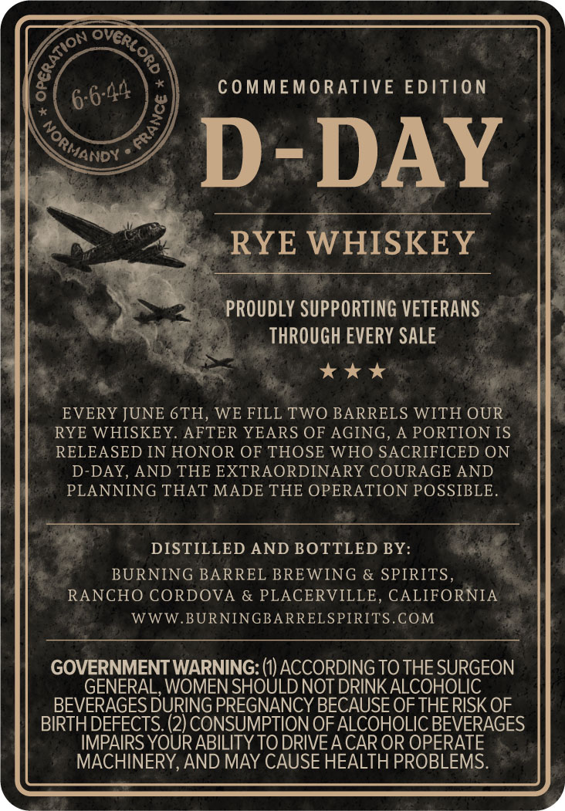
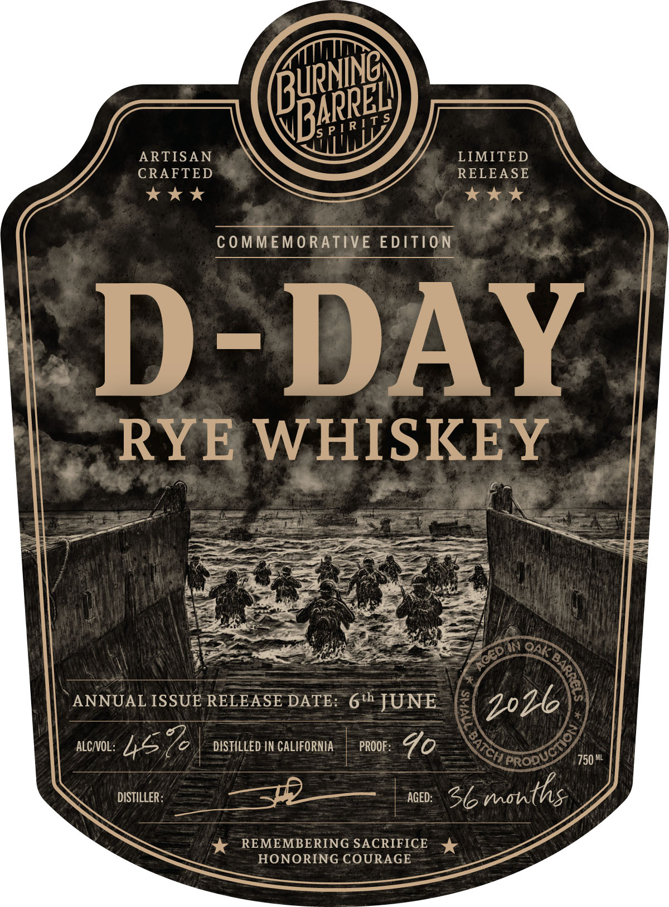
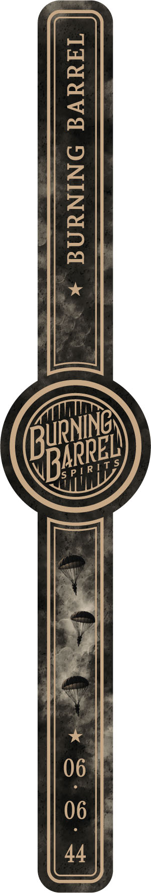

# TTB COLA Label Images - TTBID 26244001000385

**Brand Name:** BURNING BARREL SPIRITS

**Fanciful Name:** D-DAY

**Issue Date:** 09/10/2026

**Origin Code:** 01

**Product Class/Type:** 142

**Source:** [TTB Public COLA Registry](https://ttbonline.gov/colasonline/viewColaDetails.do?action=publicFormDisplay&ttbid=26244001000385)

## Label Images

### Back Label

### Front Label

### Label 3

## Extracted Label Text

*Text extracted via OCR - may contain errors*

*1 image(s) excluded: text did not meet readability threshold*

### Back Label

COMMEMORATIVE EDition
D-DAY
RYE WHISKEY
PROUDLY SUPPORTING VETERANS
THROUGH EVERY SALE
EVERY JUNE 6TH
WE FILL TWO BARRELS WITH OUR
RYE WHISKEY_
AFTER YEARS OF AGING, A PORTION IS
RELEASED IN HONOR OF THOSE WHO SACRIFICED ON
D-DAY, AND THE EXTRAORDINARY COURAGE AND
PLANNING THAT MADE THE OPERATION POSSIBLE_
DISTILLED AND BOTTLED BY:
BURNING BARREL BREWING & SPIRITS,
RANCHO CORDOVA
& PLACERVILLE
CALIFORNIA
WWW.BURNINGBARRELSPIRITS COM
GOVERNMENT WARNING: (1) ACCORDING TO THE SURGEON
GENERAL, WOMEN SHOULD NOT DRINK ALCOHOLIC
BEVERAGES DURING PREGNANCY BECAUSE OF THE RISK OF
BIRTHDEFECTS: (2) CONSUMPTION OFALCOHOLIC BEVERAGES
IMPAIRS YOUR ABILITY TO DRIVEA CAR OR OPERATE
MACHINERY,AND MAY CAUSE HEALTH PROBLEMS.
overl
{
8
6 6-44
2
NorMand

### Front Label

Tt;
ARTISAN
LIMITED
CRAFTED
RELEASE
COMMEMORATIVE EDITION
D-DAY
RYE
WHISKEY
N
8
ANNUAL ISSUE RELEASE DATE: 6th JUNE
ALCNOL:
DISTILLED IN CALIFORNIA
PROOF :
4o
PROD
750 ML
DISTILLER:
AGED:
Sb6months
REMEMBERING SACRIFICE
HONORING COURAGE
RuRNING
BARREL)
5 P [ R
"Oak [
CED
2026
457
