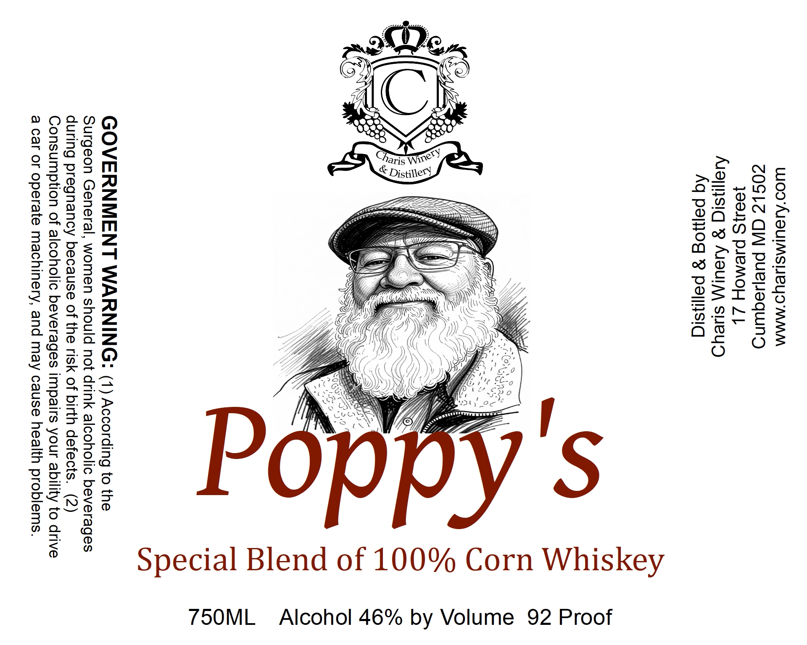

# TTB COLA Label Images - TTBID 26244001000393

**Brand Name:** CHARIS WINERY & DISTILLERY

**Fanciful Name:** POPPY'S

**Issue Date:** 09/25/2026

**Origin Code:** 25

**Product Class/Type:** 143

**Source:** [TTB Public COLA Registry](https://ttbonline.gov/colasonline/viewColaDetails.do?action=publicFormDisplay&ttbid=26244001000393)

## Label Images

### Back Label

## Extracted Label Text

*Text extracted via OCR - may contain errors*

**Detected Proof:** 92

### Back Label

Wwoo'AISUIMSHeyUo MMM
ZOSLZ GW pueequind
}804]S PAEMOH Z|
Aiaiysiq g Aveul\ sueyd
Aq paijog 8 palinsiq

Corn Whiskey

Special Blend of 100%

GOVERNMENT WARNING: (1) According to the
Surgeon General, women should not drink alcoholic beverages
during pregnancy because of the risk of birth defects. (2)
Consumption of alcoholic beverages impairs your ability to drive
a car or operate machinery, and may cause health problems.

by Volume 92 Proof

750ML_ Alcohol 46%
