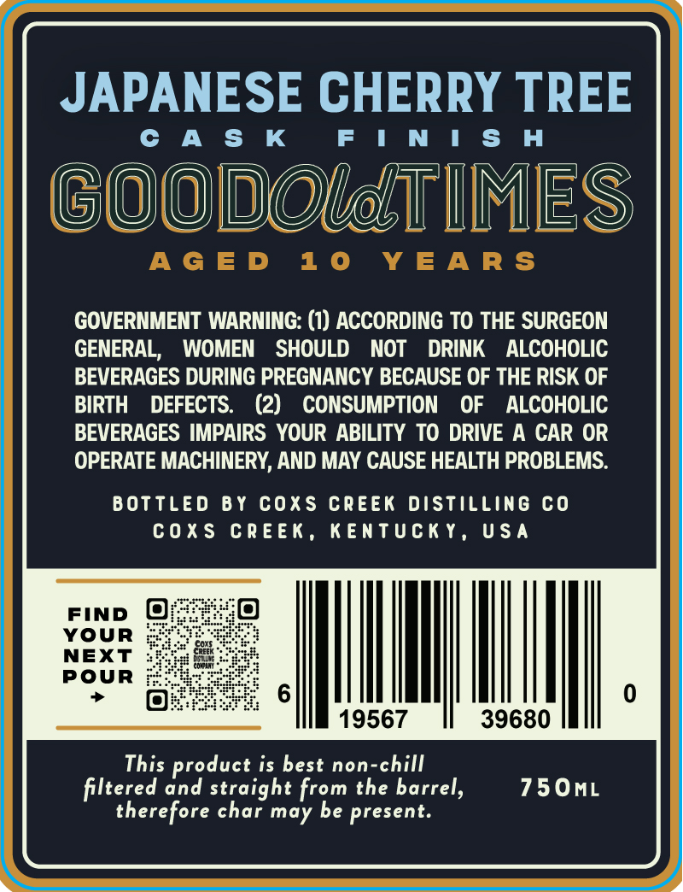
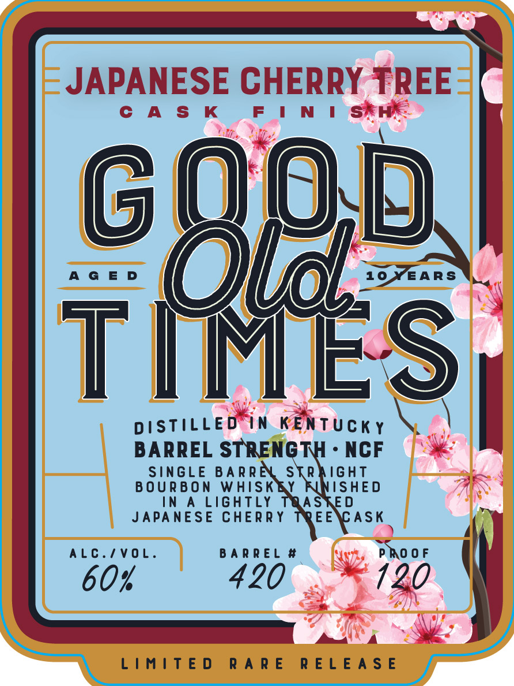

# TTB COLA Label Images - TTBID 26244001000409

**Brand Name:** GOOD OLD TIMES

**Fanciful Name:** JAPANESE CHERRY TREE CASK FINISH

**Issue Date:** 09/10/2026

**Origin Code:** 22

**Product Class/Type:** 146

**Source:** [TTB Public COLA Registry](https://ttbonline.gov/colasonline/viewColaDetails.do?action=publicFormDisplay&ttbid=26244001000409)

## Label Images

### Back Label

### Front Label

## Extracted Label Text

*Text extracted via OCR - may contain errors*

**Detected Proof:** 120

### Back Label

JAPANESE CHERRY TREE

CAS K

FINISH

GOODOlETIMES

GOVERNMENT WARNING: (1) ACCORDING TO THE SURGEON

GENERAL, WOMEN SHOULD NOT DRINK ALCOHOLIC

BEVERAGES DURING PREGNANCY BECAUSE OF THE RISK OF

BIRTH DEFECTS. (2) CONSUMPTION OF ALCOHOLIC

BEVERAGES IMPAIRS YOUR ABILITY TO DRIVE A CAR OR

OPERATE MACHINERY, AND MAY CAUSE HEALTH PROBLEMS.

BOTTLED BY COXS CREEK DISTILLING CO

COXS CREEK, KENTUCKY, USA

Find @

YOUR

POUR

NEXT

Wh

0

!

19567

39680

This product is best non-chill

750mL

filtered and straight from the barrel,

therefore char may be present.

### Front Label

a

i=

a

IE

=

N I

Ap.

AGED

AN

a

Ss

DISTILLED IN rBNtucky \

- NCF

|

BARREL STRENGT

SINGLE BARR

STRAIGHT

BOURBON WHISK

ISHED

|

A LIGHTLY

AS

JAPANESE CHERRY

ASK

ALC./VOL

BARREL #

PROOF

\

60%

420

120

|

LIMITED RARE RELEASE
