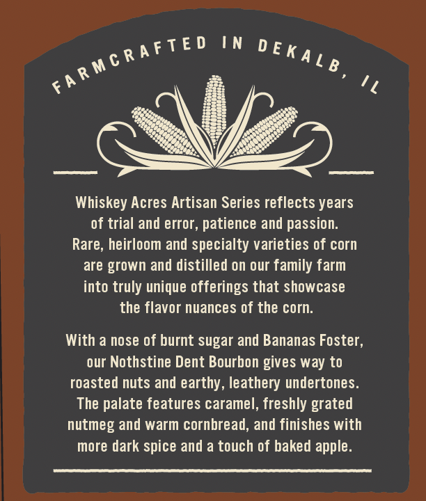
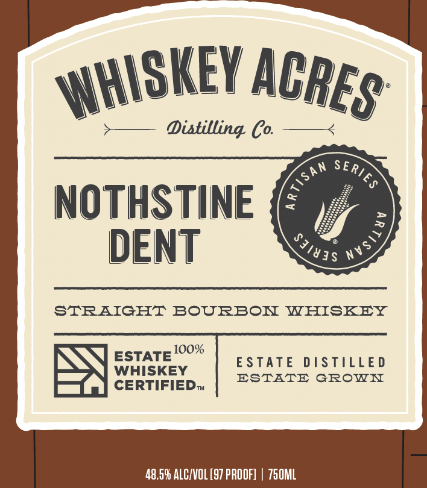
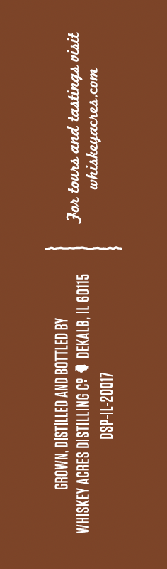
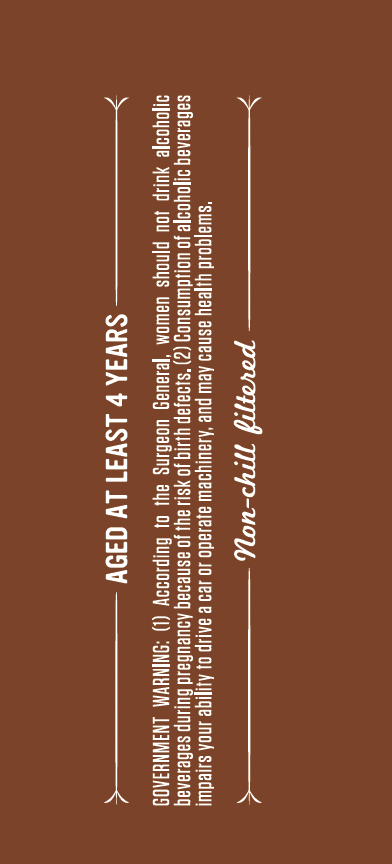

# TTB COLA Label Images - TTBID 26244001000453

**Brand Name:** WHISKEY ACRES DISTILLING CO

**Fanciful Name:** NOTHSTINE DENT

**Issue Date:** 09/10/2026

**Origin Code:** 04

**Product Class/Type:** 101

**Source:** [TTB Public COLA Registry](https://ttbonline.gov/colasonline/viewColaDetails.do?action=publicFormDisplay&ttbid=26244001000453)

## Label Images

### Back Label

### Front Label

### Label 3

### Label 4

## Extracted Label Text

*Text extracted via OCR - may contain errors*

**Detected Proof:** 97

### Back Label

Whiskey Acres Artisan Series reflects years
of trial and error, patience and passion.
Rare, heirloom and specialty varieties of corn
are grown and distilled on our family farm
into truly unique offerings that showcase
the flavor nuances of the corn.

With a nose of burnt sugar and Bananas Foster,
our Nothstine Dent Bourbon gives way to
roasted nuts and earthy, leathery undertones.
The palate features caramel, freshly grated
nutmeg and warm cornbread, and finishes with
more dark spice and a touch of baked apple.

### Front Label

Distilling Co
NOTHSTINE
6
DENT
STRAIGHT
BOURBOI
WHISKEY
10O%
ESTATE
E STATE
D /STILLE D
WHISKEY
ESTTE
GROWI
CERTIFIEDT
48.59 ALCIVOL [97 PROOF]
750ML
WHISKEY _
ACRES
SERIES
tiSan
nVsi}
83183$_

### Label 3

1100¢-1-dS0
mor voysohoyrTyn ‘ ¢
gra via, pu V0} VOL S109 11 S1VNI0 & od SNITILSIO SIUOV AJNSIHM

AQ OFILLOG ONY GATIUSIO NMOUD

### Label 4

PE) EES JF
*slua|gold yljeay asned AeW pUe ‘ALaUIy9eW ajelado JO 129 e aALJp O fe InOA siiedwt

$aGesanag o1oyoofe JO Uo}dwWnsuog (2) "si9a}ap YiNIg JOYSL! Ay) Jo asnedag ADUEUBaLd BulINp saBelanaq
D1OYoo]e YUIIP JOU P[noys UAwWOM ‘Jelavag UOaBINg ay) o) Guypodoy (1) “ONINHVM LNSWNH3A09

>——————— Sava ¢ LSW31 LY d39y ——————<
