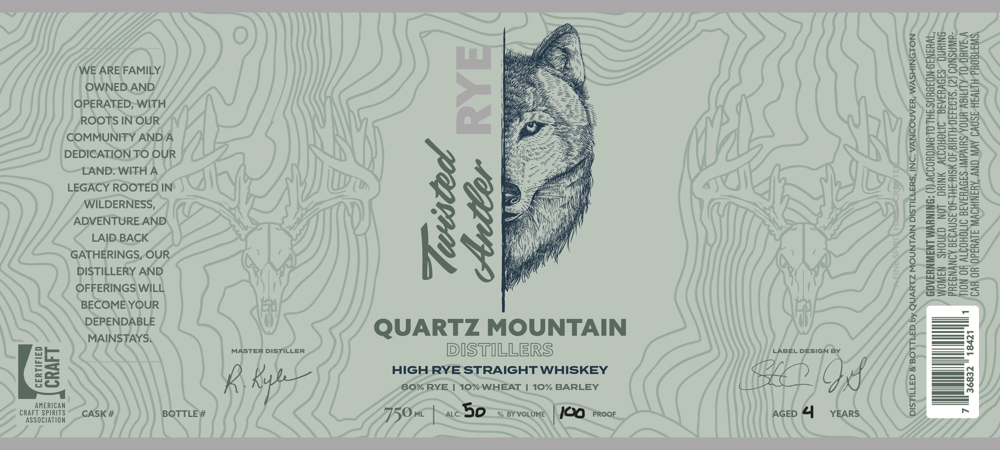
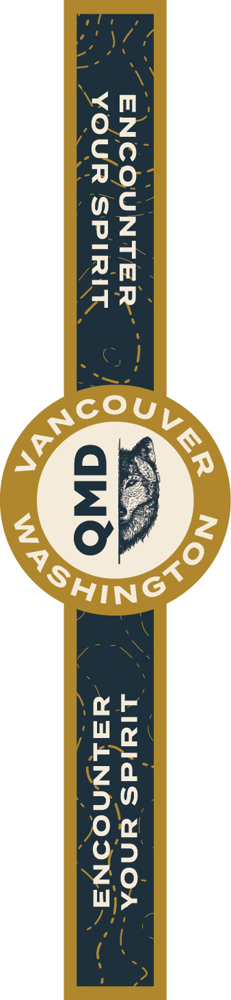

# TTB COLA Label Images - TTBID 26244001000483

**Brand Name:** QUARTZ MOUNTAIN DISTILLERS

**Fanciful Name:** TWISTED ANTLER RYE

**Issue Date:** 09/11/2026

**Origin Code:** 07

**Product Class/Type:** 100

**Source:** [TTB Public COLA Registry](https://ttbonline.gov/colasonline/viewColaDetails.do?action=publicFormDisplay&ttbid=26244001000483)

## Label Images

### Label 1

### Label 2

## Extracted Label Text

*Text extracted via OCR - may contain errors*

*1 image(s) excluded: text did not meet readability threshold*

### Label 1

WE ARE FAMILY
OWNED.AND
OPERATED; WITH
ROOTS IN OUR
COMMUNITY ANDA
DEDICATION 7O OUR
LAND: WITH A
LEGACY ROOTED IN
WILDERNESS,
ADVENTURE.AND
LAID.BACK
GATHERINGS,OUR
DISTILLERY AND
OFFERINGS WILL
BECOME\YOUR

DEPENDABLE QUARTZ MOUNTAIN

PREGNANCY BECAUSE OF-THE-RISK OF BIRTHDEFECTS. (2) CONSUMP-
TION OF ALCOHOLIC BEVERAGES-IMPAIRS’ YOUR ABILITY TO/DRIVE.A
CAR, OR\OPERATE MACHINERY, AND. MAY CAUSE-HEALTH*PROBLEMS,

GOVERNMENT WARNING: (1). ACCORDING TO THESURGEON GENERAL;
WOMEN SHOULD NOT DRINK ALCOHOLIC BEVERAGES~ DURING

1

MAINSTAYS. g
= Fs MASTER DISTILLER [ID I] ST LILE RS LABEL DESIGN BY =
= fi HIGH RYE STRAIGHT WHISKEY (EP 4 on
er) ; OT, S0% RYE | 10% WHEAT | 10% BARLEY _—

AMERICAN

SS CASK # BOTTLE # 7T5Omt | we OO % BY VOLUME | Ja PROOF AGED ra YEARS.

DISTILLED & BOTTLED by, QUARTZ MOUNTAIN DISTILEERS, INC’ VANCOUVER; WASHINGTON

7
