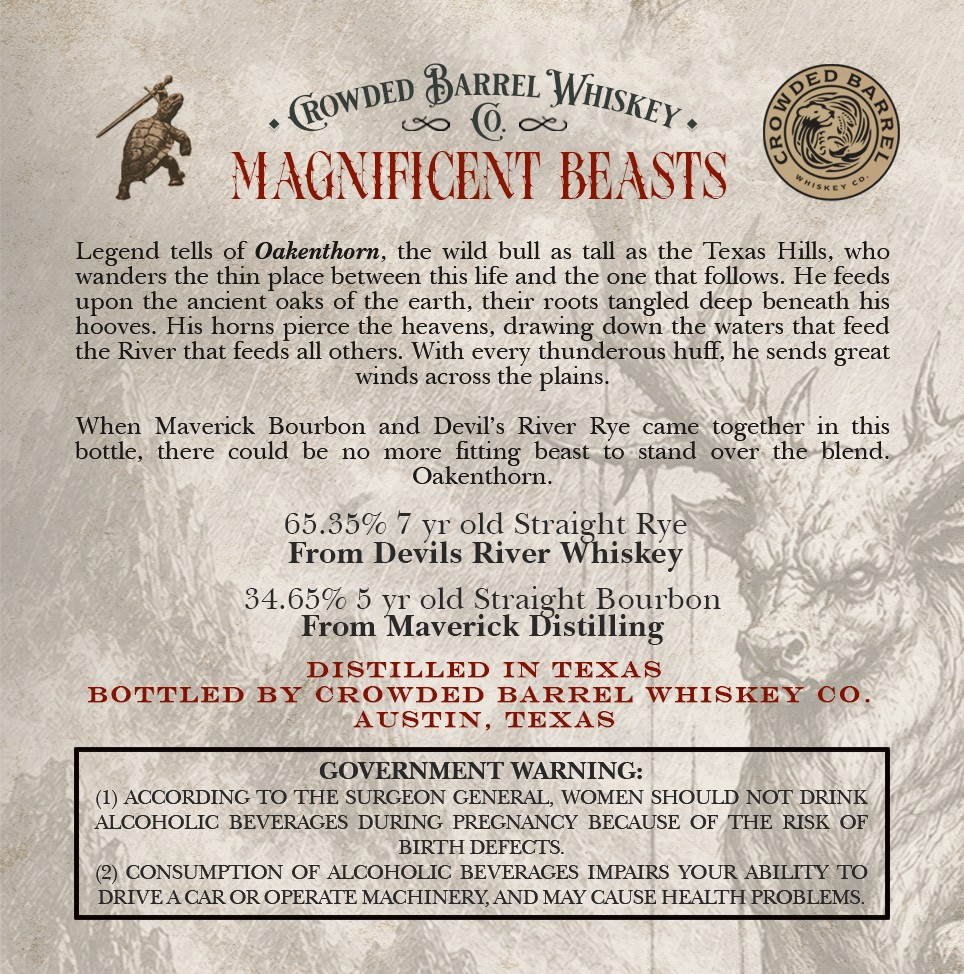
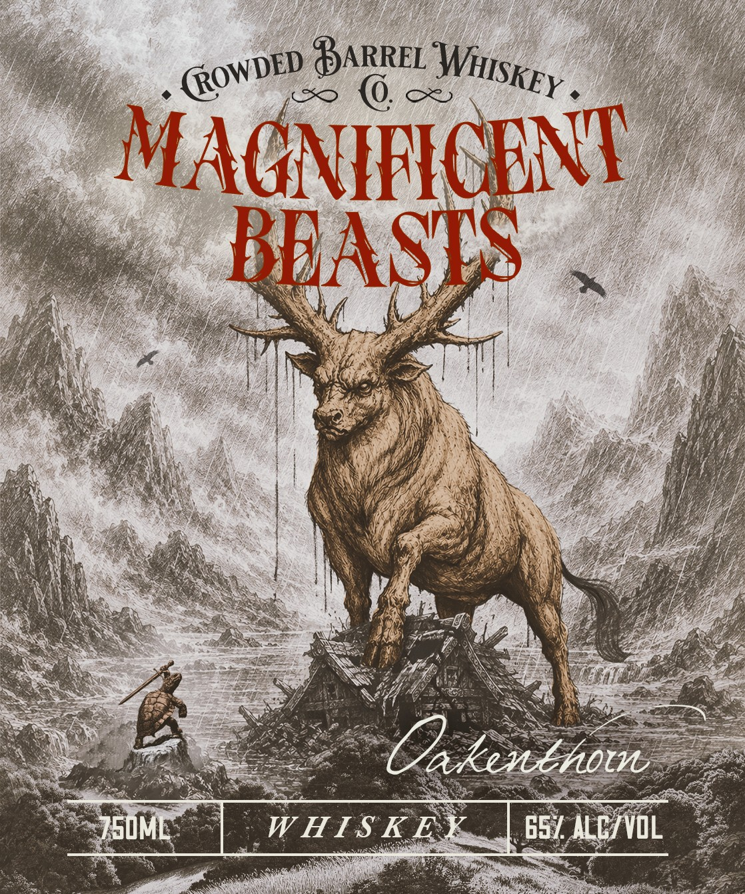

# TTB COLA Label Images - TTBID 26244001000517

**Brand Name:** MAGNIFICENT BEASTS

**Fanciful Name:** OAKENTHORN

**Issue Date:** 09/09/2026

**Origin Code:** 44

**Product Class/Type:** 140

**Source:** [TTB Public COLA Registry](https://ttbonline.gov/colasonline/viewColaDetails.do?action=publicFormDisplay&ttbid=26244001000517)

## Label Images

### Back Label

### Label 1

## Extracted Label Text

*Text extracted via OCR - may contain errors*

*1 image(s) excluded: text did not meet readability threshold*

### Back Label

ARREL
MACNIFICENT BEASTS
Legend tells of Oakenthorn, the wild bull as tall as the Texas Hills,who
wanders the thin place between this life and the one that follows
He feeds
upon the ancient oaks of the earth, their roots tangled
beneath his
hooves_
His horns
the heavens, drawing down the waters that feed
the River that feeds all others; With every thunderous huff; he sends great
winds across the
When
Maverick
Bourbon
and
Devil's River Rye
came
together in this
bottle, there could be
no
more
beast
to stand
over the
blend_
Oakenthorn.
65.359
YI old Straight Rye
From Devils River Whiskey
34.659 5
YI old Straight Bourbon
From Maverick
Distilling
DISTILLED
IN
TEXAS
BOTTLED
BY
OROWDED
BARREL
WHISKEY
0o
AUSTIN
TEXAS
GOVERNMENT WARNING:
(1) ACCORDING TO THE SURGEON GENERAL, WOMEN SHOULD NOT DRINK
ALCOHOLIC BEVERAGES DURING PREGNANCY BECAUSE OF
THE RISK
OF
BIRTH DEFECTS
CONSUMPTION OF ALCOHOLIC BEVERAGES IMPAIRS YOUR ABILITY TO
DRIVEA CAR OR OPERATE MACHINERYAND MAY CAUSE HEALTH PROBLEMS.
WHISKEY _
(ROWDED
deep
pierce
plains.
fitting
