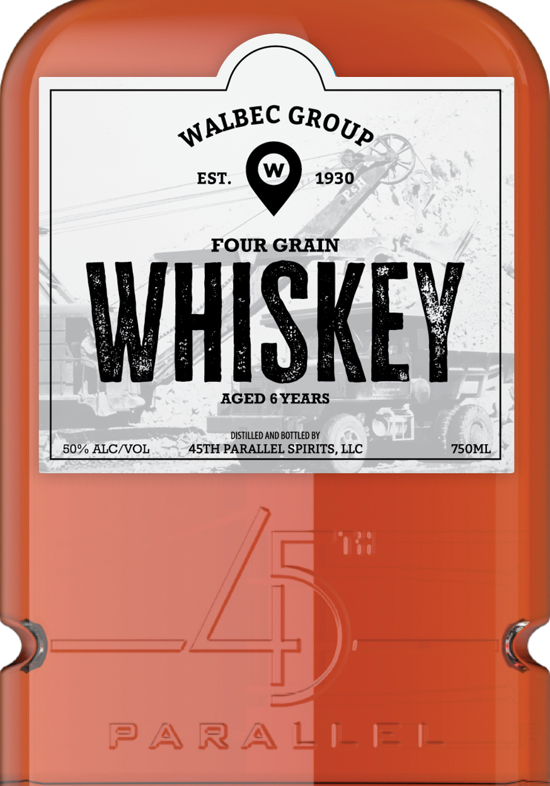
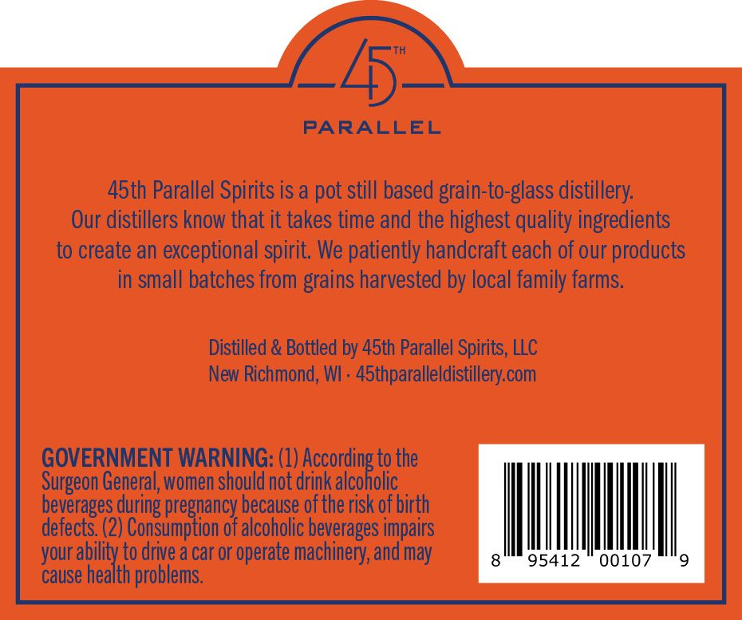

# TTB COLA Label Images - TTBID 26244001000525

**Brand Name:** 45TH PARALLEL

**Fanciful Name:** WALBEC

**Issue Date:** 09/09/2026

**Origin Code:** 48

**Product Class/Type:** 140

**Source:** [TTB Public COLA Registry](https://ttbonline.gov/colasonline/viewColaDetails.do?action=publicFormDisplay&ttbid=26244001000525)

## Label Images

### Label 1

### Label 2

## Extracted Label Text

*Text extracted via OCR - may contain errors*

**Detected Proof:** 100
**Detected Age:** 6 Years

### Label 1

EST_
1930
26
FOUR GRAIN
WHISKEY
AGED 6 YEARS
distilleD AND BOTTLED BY
50% ALCIVOL
45TH PARALLEL SPIRITS, LLC
750ML
PARAZEE
WALBEC
GROUP

### Label 2

PARALLEL

Adth Parallel Spirits is a pot still based grain-to-glass distillery.
Our distillers know that it takes time and the highest quality ingredients
to create an exceptional spirit. We patiently handcraft each of our products
in small batches from grains harvested by local family farms.

Distilled & Bottled by 45th Parallel Spirits, LLC
New Richmond, WI - 45thparalleldistillery.com

GOVERNMENT WARNING: (1) iors tothe

Surgeon General, women should not drink alcoholic
beverages during pregnancy because of the risk of birth
defects. (2) Consumption of alcoholic beverages impairs
your ability to drive a car or operate machinery, and may
cause health problems,
