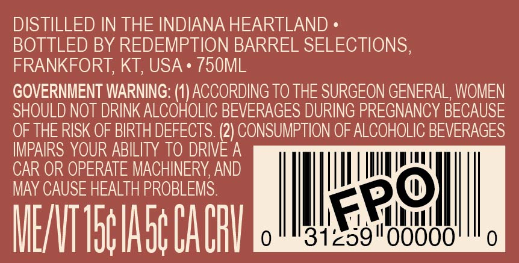
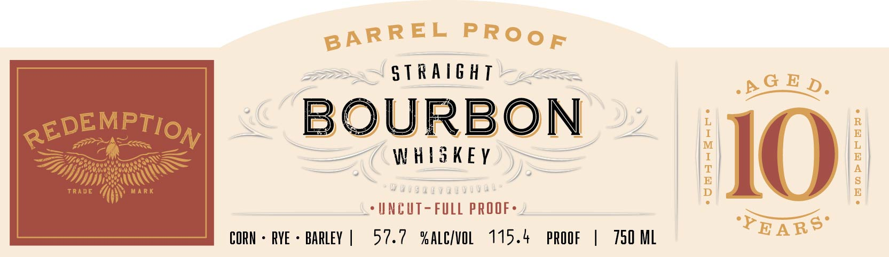
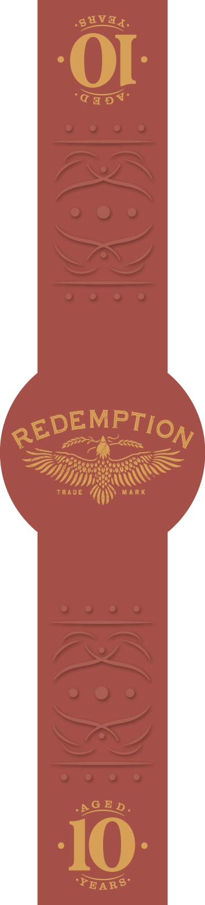

# TTB COLA Label Images - TTBID 26244001000533

**Brand Name:** REDEMPTION

**Fanciful Name:** BARREL PROOF

**Issue Date:** 09/09/2026

**Origin Code:** 22

**Product Class/Type:** 101

**Source:** [TTB Public COLA Registry](https://ttbonline.gov/colasonline/viewColaDetails.do?action=publicFormDisplay&ttbid=26244001000533)

## Label Images

### Back Label

### Front Label

### Label 3

## Extracted Label Text

*Text extracted via OCR - may contain errors*

*1 image(s) excluded: text did not meet readability threshold*

**Detected Proof:** 115.4

### Back Label

DISTILLED IN THE INDIANA HEARTLAND =

BOTTLED BY REDEMPTION BARREL SELECTIONS

FRANKFORT, KT, USA + 750ML

GOVERNMENT WARNING: (1) ACCORDING TO THE SURGEON GENERAL, WOMEN

SHOULD NOT DRINK ALCOHOLIC BEVERAGES DURING PREGNANCY BECAUSE

OF THE RISK OF BIRTH DEFECTS. aN CONSUMPTION OF ALCOHOLIC BEVERAGES

IMPAIRS YOUR ABILITY TO DRIVE A

CAR OR OPERATE MACHINERY, AND

MAY CAUSE HEALTH PROBLEMS

nuns,

hag

"a sd

ire}

ollll

MIE/VT Toe Abt CA CRY

0

31 gH

### Front Label

S T Ra/6 HT
A
REDEMPTION
BOURBON
W hasKEY
H10h
TRade
MaR K
UncUT-
FuLL PROOF _
CORN
RYE
barley
57.7
% ALCIvoL
115.4
PROOF
750 ML
'PEARS"
BARREL
PRooF
G E Da
