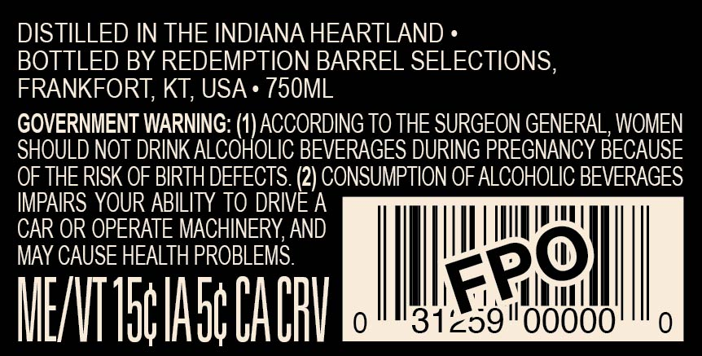
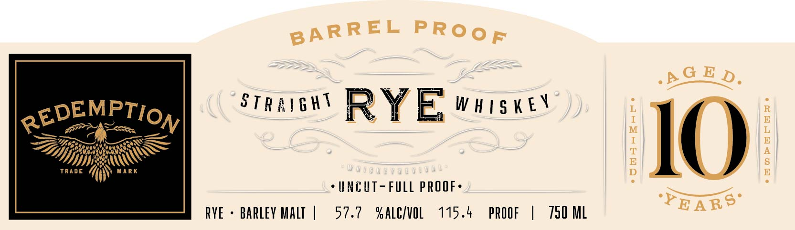
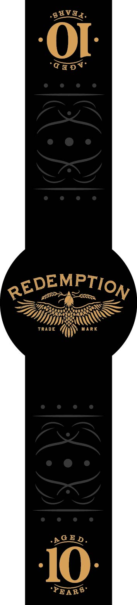

# TTB COLA Label Images - TTBID 26244001000537

**Brand Name:** REDEMPTION

**Fanciful Name:** BARREL PROOF

**Issue Date:** 09/09/2026

**Origin Code:** 22

**Product Class/Type:** 102

**Source:** [TTB Public COLA Registry](https://ttbonline.gov/colasonline/viewColaDetails.do?action=publicFormDisplay&ttbid=26244001000537)

## Label Images

### Back Label

### Front Label

### Label 3

## Extracted Label Text

*Text extracted via OCR - may contain errors*

**Detected Proof:** 115.4

### Back Label

DISTILLED IN THE INDIANA HEARTLAND

BOTTLED BY REDEMPTION BARREL SELECTIONS

FRANKFORT, KT, USA + 750ML

GOVERNMENT WARNING: (1) ACCORDING TO THE SURGEON GENERAL, WOMEN

SHOULD NOT DRINK ALCOHOLIC BEVERAGES DURING PREGNANCY BECAUSE

OF THE RISK OF BIRTH DEFECTS. aN CONSUMPTION OF ALCOHOLIC BEVERAGES

IMPAIRS YOUR ABILITY TO DRIVE A

CAR OR OPERATE MACHINERY, AND

MAY CAUSE HEALTH PROBLEMS

Ds

lke

hu

|

ME/VT Toe Abt CA CRY

319

"900

### Front Label

AG E D.
REDEMPTION
STR A |6 HT
RYE w #tsK Ev
Trade
RK
HIO|
uncuT- FuLL PROF .
YEAR8"
RYE
barley Malt
57.7
% ALCIvoL
115.4
PROOF
750 ML
BARREL
PRooF

### Label 3

aVa>

-gEV8q,

‘Capt
= ="
Siti meta

YIP SEW
Trane GN war

PGE,

& <

Sa
