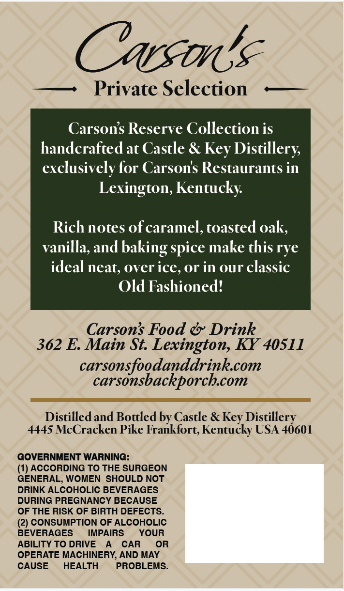
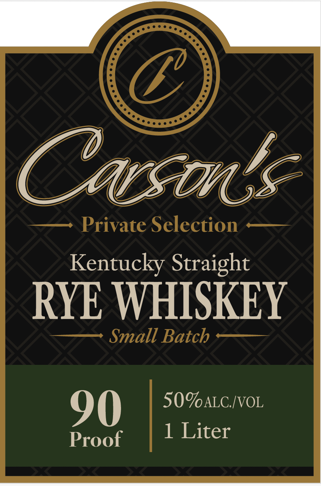

# TTB COLA Label Images - TTBID 26244001000591

**Brand Name:** CARSON'S

**Fanciful Name:** PRIVATE SELECTION

**Issue Date:** 09/09/2026

**Origin Code:** 22

**Product Class/Type:** 102

**Source:** [TTB Public COLA Registry](https://ttbonline.gov/colasonline/viewColaDetails.do?action=publicFormDisplay&ttbid=26244001000591)

## Label Images

### Back Label

### Front Label

## Extracted Label Text

*Text extracted via OCR - may contain errors*

**Detected Proof:** 100

### Back Label

Carsona
Private Selection
Carsons Reserve Collection is
handcrafted at Castle &
Distillery
exclusively for Carsons Restaurants in
Lexington, Kentucky
Rich notes of caramel,toasted oak,
vanilla, and baking spice make this rye
ideal neat; overice,or in our classic
Old Fashioned?
Carsons Food & Drink
362 E Main St:
Lexington KY 40S11
carsonsfoodanddrinkcom
carsonsbackporchcom
Distilledand Bottled by Castle & Key Distillery
4445 McCracken Pike Frankfort; Kentucky USA 4601
GOVERNMENT WARNING:
(1) ACCORDING TO THE SURGEON
GENERAL; WOMEN
SHOULD NOT
DRINK ALCOHOLIC BEVERAGES
DURING PREGNANCY BECAUSE
OF THE RISK OF BIRTH DEFECTS_
(2) CONSUMPTION OF ALCOHOLIC
BEVERAGES
IMPAIRS
YouR
ABILITY TO DRIVE
CAR
OR
OPERATE MACHINERY, AND MAY
CAUSE
HEALTH
PROBLEMS.
Key

### Front Label

Oasana
Private Selection
Kentucky Straight
RYE WHISKEY
Small Batch
90
50%ALC IVOL
Proof
1
Liter
