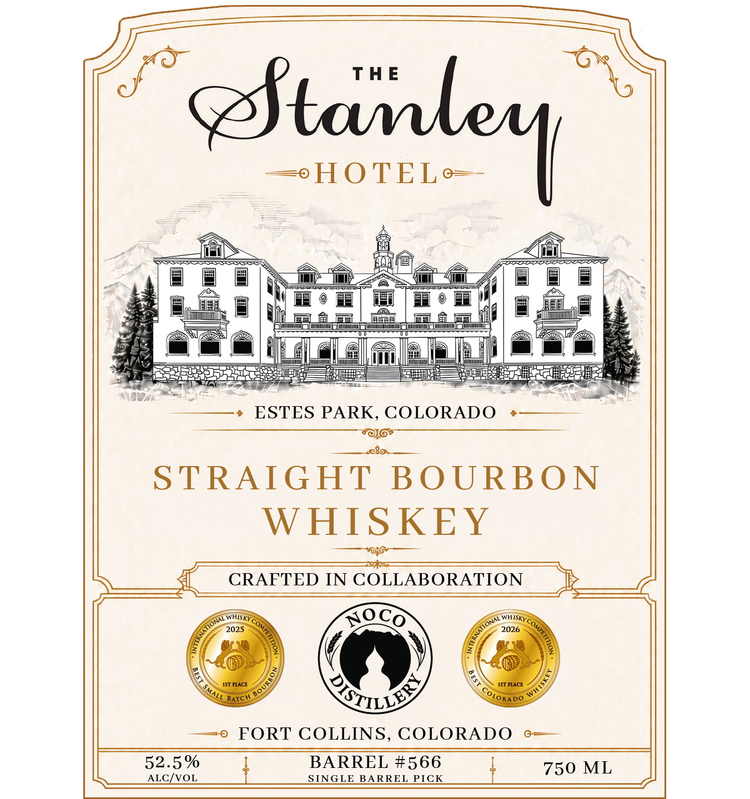
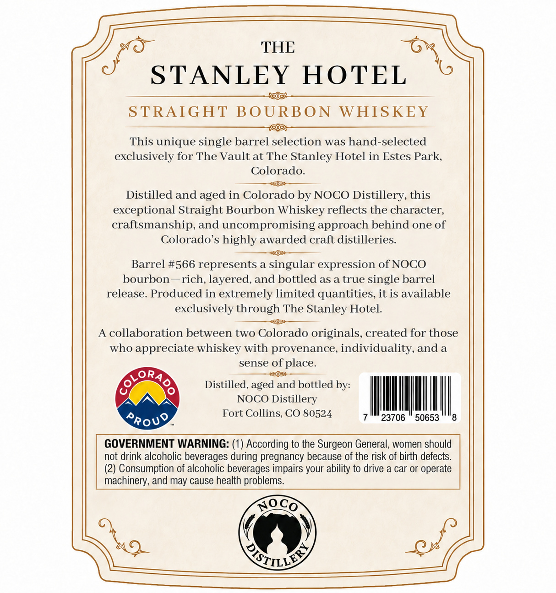

# TTB COLA Label Images - TTBID 26244001000594

**Brand Name:** NOCO DISTILLERY

**Issue Date:** 09/10/2026

**Origin Code:** 13

**Product Class/Type:** 101

**Source:** [TTB Public COLA Registry](https://ttbonline.gov/colasonline/viewColaDetails.do?action=publicFormDisplay&ttbid=26244001000594)

## Label Images

### Front Label

### Label 2

## Extracted Label Text

*Text extracted via OCR - may contain errors*

**Detected Proof:** 105

### Front Label

0
HOTEL o
ESTES PARK, COLORADO
STRAIGHT
BOURBON
WHISKEY
CRAFTED IN COLLABORATION
AQco
2025
2026
1ST PLACE
IST PLACE
BATC H
FORT COLLINS, COLORADO
52.5 %
BARREL #566
750 ML
ALCIvoL
SINGLE BARREL PICK
Ftamlexl
WHISKY
WHISKY
(
(
)
)
1
)
BOURBC
QTILLES
SMALL
QIORADO

### Label 2

THE

f"¢

TANLEY HOTE

ras

STRAIGHT BOURBON WHISKEY

This unique single barrel selection was hand-selected

exclusively for The Vault at The Stanley Hotel in Estes Park

Colorado

+f.

Distilled and aged in Colorado by NOCO Distillery, this

exceptional Straight Bourbon Whiskey reflects the character,

craftsmanship, and uncompromising approach behind one of

Colorado’s highly awarded craft distilleries.

3

Barrel #566 represents a singular expression of NOCO

bourbon—rich, layered, and bottled as a true single barrel

release. Produced in extremely limited quantities, it is available

exclusively through The Stanley Hotel.

——

A collaboration between two Colorado originals, created for those

who appreciate whiskey with provenance, individuality, and a

sense sense Ounce?

CLz

'O“ain

Distilled aged aalbott aged and bottled by:

AYN

NOCO Distillery

|

|

|

:

|

|

|

Fort Collins, CO 80524

7

23706

50653

8

ROV®

GOVERNMENT WARNING: (1) According to the Surgeon General, women should

not drink alcoholic beverages during pregnancy because of the risk of birth defects

(2) Consumption of alcoholic beverages impairs your ability to drive a car or operate

machinery, and may cause health problems.

BOCO

A

Srey

2%
