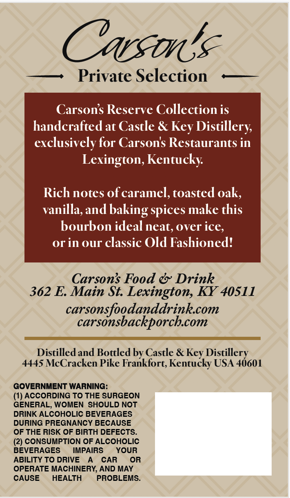
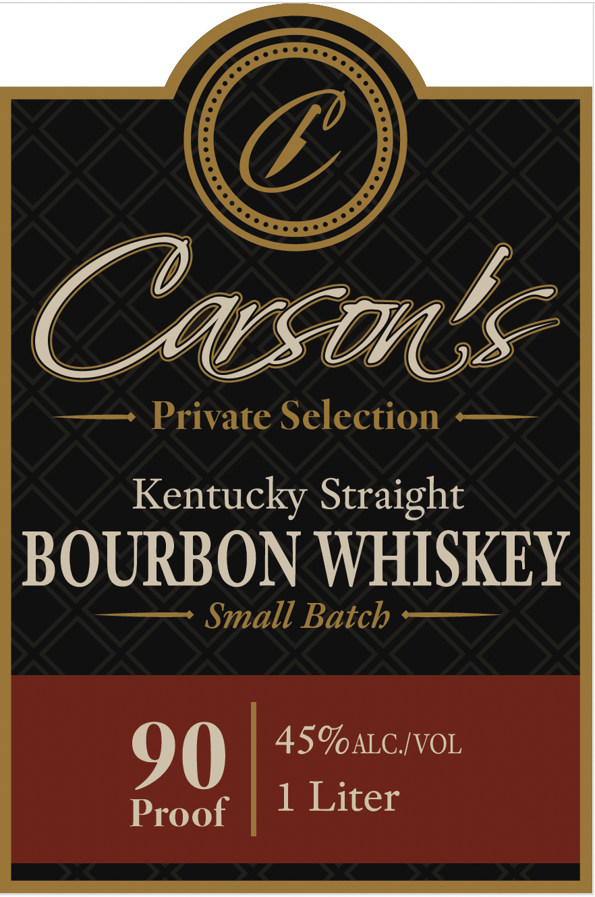

# TTB COLA Label Images - TTBID 26244001000601

**Brand Name:** CARSON'S

**Fanciful Name:** PRIVATE SELECTION

**Issue Date:** 09/09/2026

**Origin Code:** 22

**Product Class/Type:** 101

**Source:** [TTB Public COLA Registry](https://ttbonline.gov/colasonline/viewColaDetails.do?action=publicFormDisplay&ttbid=26244001000601)

## Label Images

### Back Label

### Front Label

## Extracted Label Text

*Text extracted via OCR - may contain errors*

### Back Label

Carsona
Private Selection
Carsons Reserve Collection is
handcrafted at Castle & Key Distillery
exclusively for Carsons Restaurants in
Lexington, Kentucky
Rich notes of caramel, toasted oak,
vanilla,and baking
make this
bourbon ideal neat, over ice,
or in our classic Old Fashioned?
Carsons Food &' Drink
362 E Main St Lexington, KY 40S11
carsonsfoodanddrinkcom
carsonsbackporchcom
Distilled and Bottled by Castle &
Distillery
4445 McCracken Pike Frankfort; Kentucky USA 4601
GOVERNMENT WARNING:
(1) ACCORDING TO THE SURGEON
GENERAL; WOMEN SHOULD NOT
DRINK ALCOHOLIC BEVERAGES
DURING PREGNANCY BECAUSE
OF THE RISK OF BIRTH DEFECTS.
(2) CONSUMPTION OF ALCOHOLIC
BEVERAGES
IMPAIRS
YOUR
ABILITY TO DRIVE
CAR
OR
OPERATE MACHINERY, AND MAY
CAUSE
HEALTH
PROBLEMS_
spices
Key

### Front Label

(1
Casanta
Private Selection
Kentucky Straight
BOURBON WHISKEY
Small Batch
90
45ALC IVOL
1 Liter
Proof
