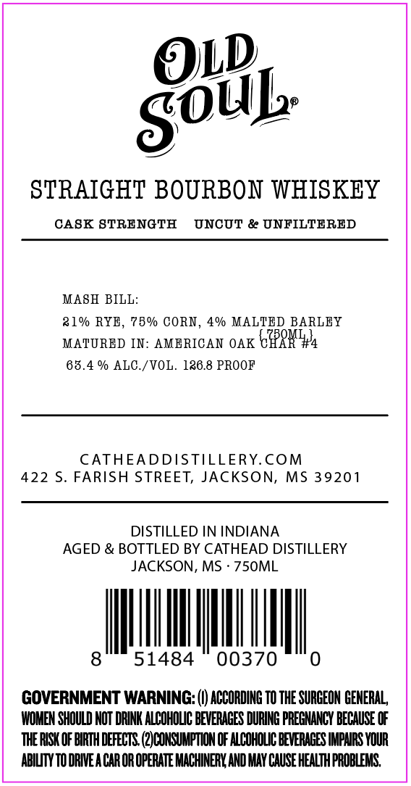
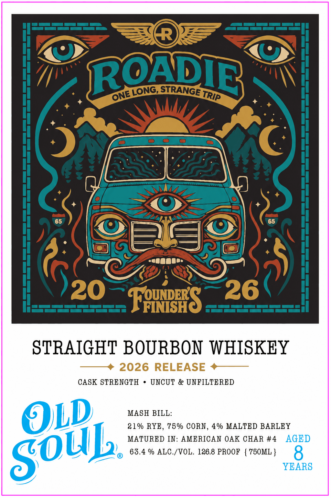

# TTB COLA Label Images - TTBID 26244001000609

**Brand Name:** OLD SOUL

**Issue Date:** 10/07/2026

**Origin Code:** 28

**Product Class/Type:** 101

**Source:** [TTB Public COLA Registry](https://ttbonline.gov/colasonline/viewColaDetails.do?action=publicFormDisplay&ttbid=26244001000609)

## Label Images

### Back Label

### Front Label

## Extracted Label Text

*Text extracted via OCR - may contain errors*

**Detected Proof:** 126.8
**Detected Age:** 8 Years

### Back Label

goUl

STRAIGHT BOURBON WHISKEY

CASK STRENGTH UNCUT & UNFILTERED

MASH BILL:

21% RYE, 75% CORN, 4% MALTED BARLEY
MATURED IN: AMERICAN OAK CPR
63.4 % ALC./VOL. 126.8 PROOF

CATHEADDISTILLERY.COM
422 S. FARISH STREET, JACKSON, MS 39201

DISTILLED IN INDIANA
AGED & BOTTLED BY CATHEAD DISTILLERY
JACKSON, MS - 750ML

IM th

GOVERNMENT WARNING: (|) ACCORDING TO THE SURGEON GENERAL,
WOMEN SHOULD NOT DRINK ALCOHOLIC BEVERAGES DURING PREGNANCY BECAUSE OF
THE RISK OF BIRTH DEFECTS. (2) CONSUMPTION OF ALCOHOLIC BEVERAGES IMPAIRS YOUR
ABILITY TO DRIVEA CAR OR OPERATE MACHINERY, AND MAY CAUSE HEALTH PROBLEMS,

### Front Label

R
ROTDIR
STRANGE-
20
FeurS
26
STRAIGHT BOURBON WHISKEY
2026 RELEASE
CASK STRENGTH
UNCUT & UNFILTERED
OLD
MASH BILL:
21% RYE , 75 % CORN, 4% MALTED BARLEY
MATURED IN: AMERICAN OAK CHAR #4
AGED
63.4 % ALC /VOL: 126.8 PROOF
750ML }
8
YEARS
LONG
ONE
TRIP
SOuL
