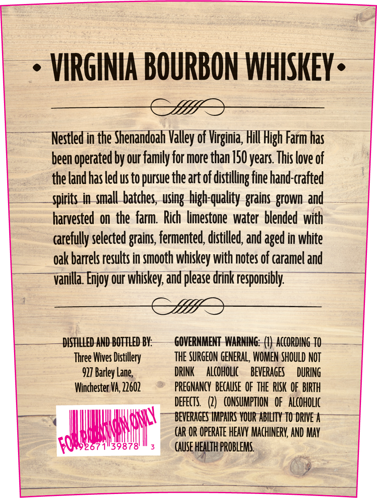
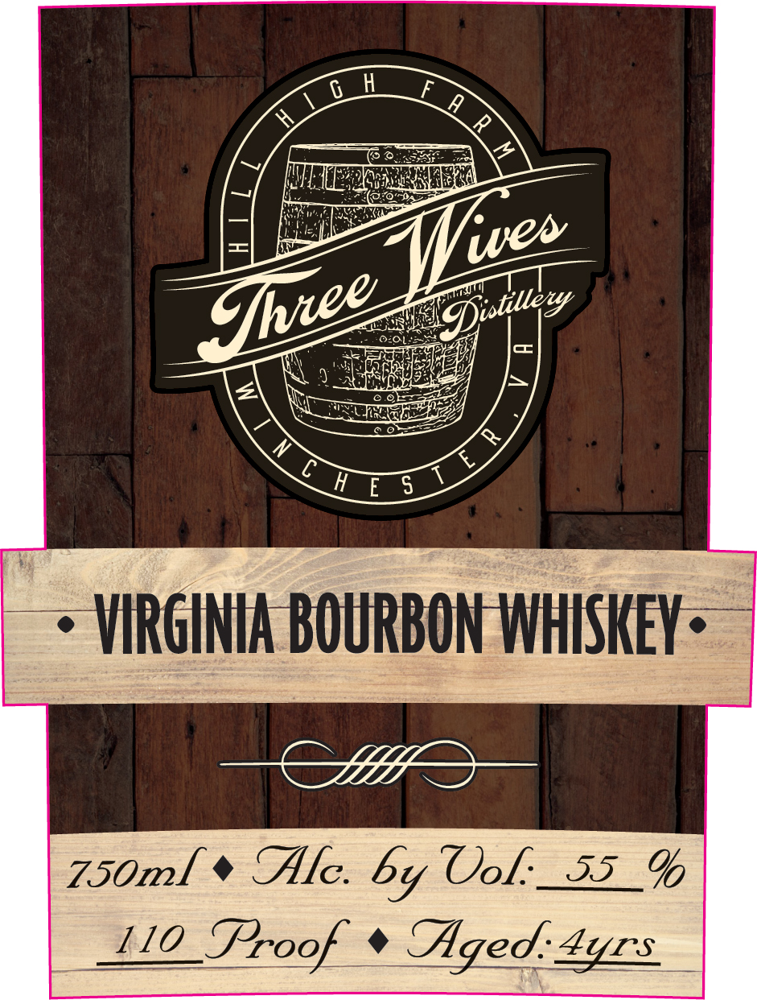

# TTB COLA Label Images - TTBID 26244001000807

**Brand Name:** THREE WIVES DISTILLERY

**Issue Date:** 09/09/2026

**Origin Code:** 05

**Product Class/Type:** 141

**Source:** [TTB Public COLA Registry](https://ttbonline.gov/colasonline/viewColaDetails.do?action=publicFormDisplay&ttbid=26244001000807)

## Label Images

### Back Label

### Label 1

## Extracted Label Text

*Text extracted via OCR - may contain errors*

*1 image(s) excluded: text did not meet readability threshold*

**Detected Age:** 50 Years

### Back Label

VIRGINIA BOURBON WHISKEY .
Nestled in the Shenandoah Valley of Virginia, Hill High Farm has
been operated by our family for more than /50years This love of
the land has ledus to pursue the art of distilling fine hand-crafted
spirits in smallbatches, using high-quality
grown and
harvested on the farm   Rich limestone water  blended with
arefully selected grains, fermented; distilled, and aged in white
oak barrels results in smooth whiskey with notes of caramel and
vanilla: Enjoy our whiskey; and please drink responsibly
DISFHLLED AND BOFTLED BY:
GOVERNMENT WARNING:
AccORding TO
Three Wives Distillery
THE SURGEON GENERAL, WOMEN SHOULD NOT
927 Barley Lane;
DRINK
ALcOhOlIc
BEVERAGES
DURINg
Winchester VA;,22602
PREGNANCY   BECAuse  OF THE  RISK  OF  BIRTH
DEFECTS   (2)   cONSUMPTION   OF   alcoholic
BEVERAGES IMPAIRS VOUR Ability TO DRIVE
car OR OpeRATe HEAVY MACHINERV; AND MAV
Foa
139878'
CAUSE hEaLTh PROBLEMS.
grains
MsWMY
