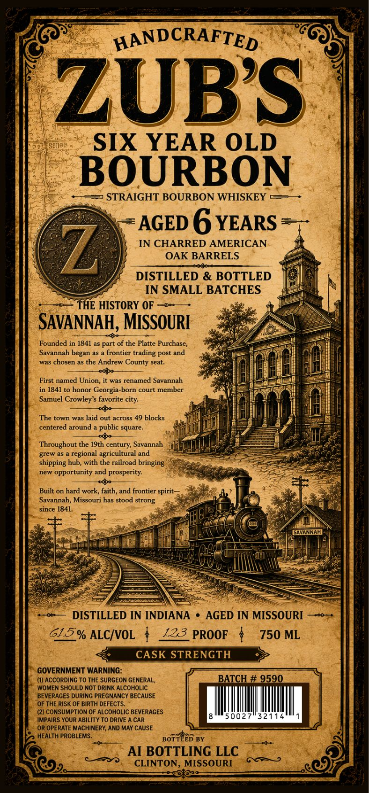

# TTB COLA Label Images - TTBID 26245001000006

**Brand Name:** ZUB'S

**Issue Date:** 10/06/2026

**Origin Code:** 29

**Product Class/Type:** 101

**Source:** [TTB Public COLA Registry](https://ttbonline.gov/colasonline/viewColaDetails.do?action=publicFormDisplay&ttbid=26245001000006)

## Label Images

### Label 1

## Extracted Label Text

*Text extracted via OCR - may contain errors*

**Detected Age:** 6 Years

### Label 1

HANDCRAFTED
ZUBS
SIX YEAR OLD
BOURBON
STRAIGHT BOURBON WHISKEY
AGED 6 YEARS
Z,
IN CHARRED AMERICAN
OAK BARRELS
DISTILLED & BOTTLED
IN SMALL BATCHES
THE HISTORY OF
SAVANNAH, MISSOURI
Founded in 1841 as part of the Platte Purchase
Savannah
frontier
trading post and
was chosen as the Andrew County seat:
named Union
it was renamed Savannah
in 1841 to
Georgia
court member
Samuel Crowley $ favorite
The town was laid out across 49 blocks
centered around
square_
Throughout the I9th century, Savannah
regional agricultural and
shipping hub, with the railroad bringing
new
opportunity and prosperity:
Built on hard work, faith, and frontier spirit
Savannah; Missouri has stood strong
since 1841.
DISTILLED IN INDIANA
AGED IN MISSOURI
615% ALCIVOL
123_PROOF
750 ML
CASK STRENGTH
GOVERNMENT WARNING:
(U) ACCORDiNG To ThE SURGEON GENERAL_
BATCH # 9590
WOMEN SHOULD NOT DRINK ALCOHOLIC
BEVERAGES DURING PREGNANCY BECAUSE
OF THE RISK OF BIRTH DEFECTS
(2) CONSUMPTION OF ALCOHOLIC BEVERAGES
IMPAIRS YOUR ABILITY TO DRIVE A CAR
5002
32114
OR OPERATE MACHINERY; AND MAY CAUSE
HEALTH PROBLEMS:
BOTTLED BY
AI BOTTLING LLC
CLINTON, MISSOURI
322
began
First
honor
-born
city:
public _
grew
