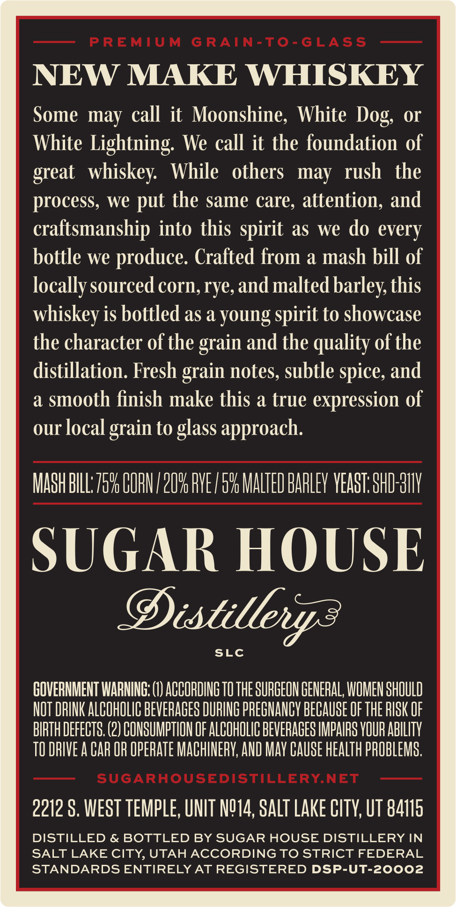
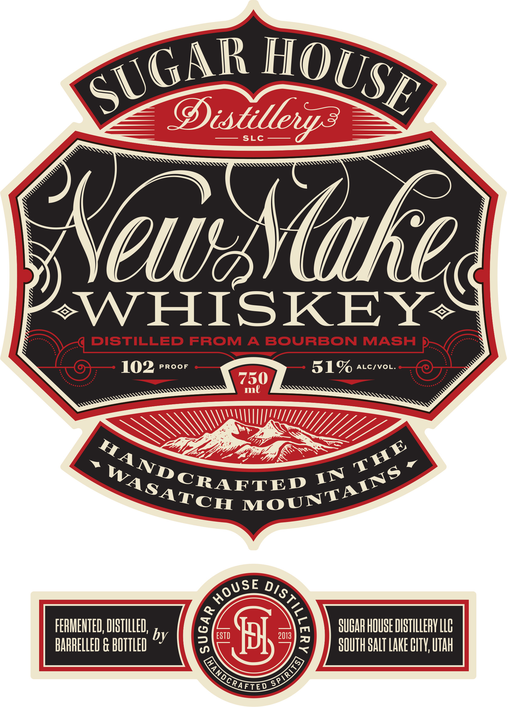
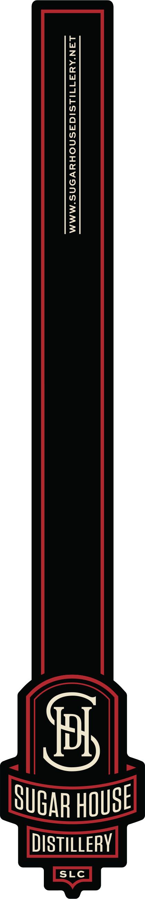

# TTB COLA Label Images - TTBID 26245001000007

**Brand Name:** SUGAR HOUSE DISTILLERY

**Issue Date:** 09/10/2026

**Origin Code:** 45

**Product Class/Type:** 140

**Source:** [TTB Public COLA Registry](https://ttbonline.gov/colasonline/viewColaDetails.do?action=publicFormDisplay&ttbid=26245001000007)

## Label Images

### Back Label

### Front Label

### Label 3

## Extracted Label Text

*Text extracted via OCR - may contain errors*

*1 image(s) excluded: text did not meet readability threshold*

**Detected Proof:** 102

### Back Label

PREMIUM
G RAIN-To-GLASS
NEW MAKE WHISKEY
Some may call it Moonshine; White
or
White Lightning: We call it the foundation of
whiskey:
While
others   may rush
the
process; we
the same care, attention; and
craftsmanship into this spirit as
we do every
bottle we
produce: Crafted from a mash bill of
locally sourced corn, rye,and malted barley this
whiskey is bottled as a young spirit to showcase
the character of the grain and the quality of the
distillation. Fresh grain notes, subtle spice, and
a
smooth finish make this a true expression of
our local
grain to glass approach:
MASH BILL  7596 COFN /2096 PVE / 596 MALTED BARLEv VEAST; SHD H11V
SUGAR HOUSE
Distillerya
SLC
COVERMMENT IARNING; (1) ACCORDING TO THE SURGEON GENERAL; VOMEN SHOULD
NOT DRINK ALCOHOLIC BEVERAGES DURING PREGNANCY BECAUSE OF THE RISK OF
BIRTH DEFECTS. (2) CONSUMPTHON OF ALCOHOLIC BEVERAGES IMPAIRS VOUR ABILITV
TO DRIVE A CAR OR OPERATE MACHINERV; AND MAY CAUSE HEALTh PROBLEMS;
SUGARHOUSEDISTILLERYNET
2212 $, WEST TEMPLE, UNIT N914, SALT Lake CITV; UT 84115
DISTILLED & BOTTLED BY SUGAR HOUSE DISTILLERY IN
SALT LAKE CITY, UTAHACCORDING TO STRICT FEDERAL
STANDARDS ENTIRELY AT REGISTERED DSP-UT-20002
Dog;
great
put

### Front Label

Oisullevz
SLC
Yeua
WHISKEY
DISTILLED
FROM
A
BOURBON
MASH
102
PROoF
51%
ALCIVOL.
750
ml
FERMEHTED; DISTILLED;
SUCAR HOUSE DISTHLLERY LLC
by
ESTD
Hl
2013
BARRELLED & BUTTLED
SOUTH SALT Lare HITV; UTah
SUGAR
HOUSE
KKakec
THE
"ANDCRAFTED
MOUNTAINS
WASATCH
IN
HOUSE
)

QANDcRAELCO
SPIRIS)
