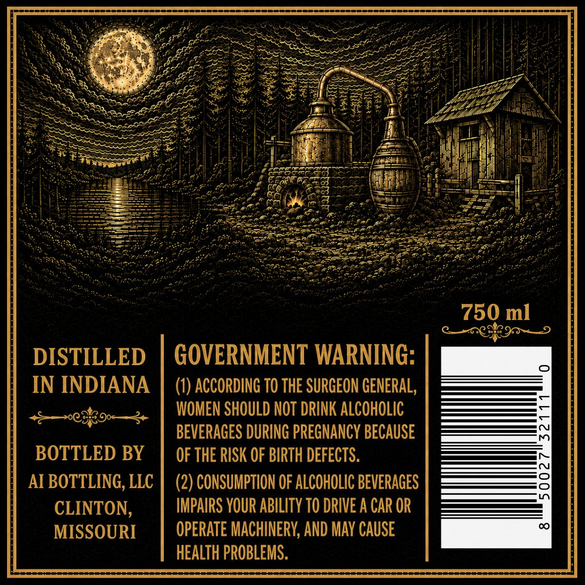
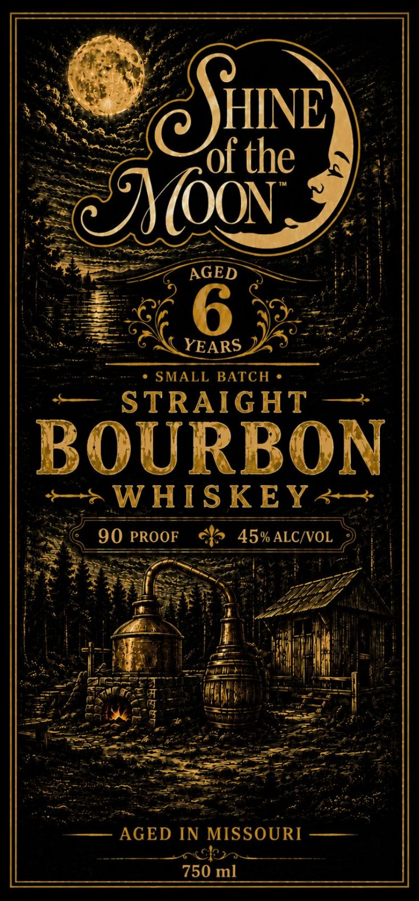

# TTB COLA Label Images - TTBID 26245001000009

**Brand Name:** SHINE OF THE MOON

**Issue Date:** 09/10/2026

**Origin Code:** 29

**Product Class/Type:** 101

**Source:** [TTB Public COLA Registry](https://ttbonline.gov/colasonline/viewColaDetails.do?action=publicFormDisplay&ttbid=26245001000009)

## Label Images

### Back Label

### Front Label

## Extracted Label Text

*Text extracted via OCR - may contain errors*

**Detected Proof:** 90
**Detected Age:** 6 Years

### Back Label

750 ml
DISTILLED
GOVERNMENT WARNING:
IN INDIANA
ACCORDING TO THE SURGEON GENERAL,
WOMEN SHOULD NOT DRINK ALCOHOLIC
BEVERAGES DURING PREGNANCY BECAUSE
BOTTLED BY
OF THE RISK OF BIRTH DEFECTS.
AI BOTTLING, LLC
(2) CONSUMPTION OF ALCOHOLIC BEVERAGES
CLINTON,
IMPAIRS YOUR ABILITY TO DRIVE A CAR OR
MISSOURI
OPERATE MACHINERV, AND MAY CAUSE
HEALTH PROBLEMS.

### Front Label

the
(OON
AGED
6
YEARS
SMALL BATCH
STRAIGHT
BOURBON
WHISKEY<
90 PROOF
45% ALC/VOL
1
AGED IN MISSOURI
750 ml
AHNE
