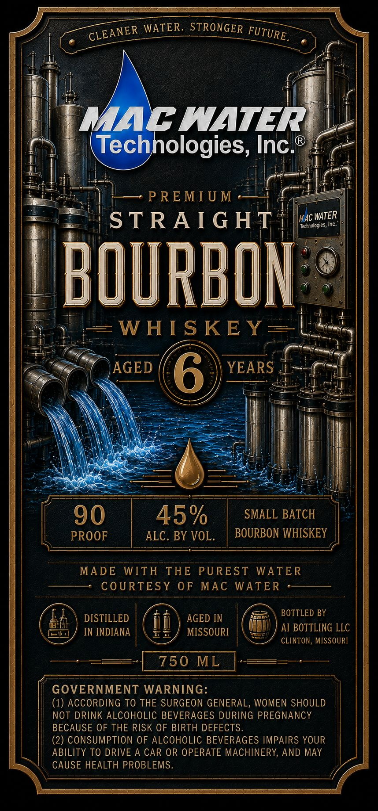

# TTB COLA Label Images - TTBID 26245001000012

**Brand Name:** MAC WATER TECHNOLOGIES, INC.

**Issue Date:** 09/09/2026

**Origin Code:** 29

**Product Class/Type:** 101

**Source:** [TTB Public COLA Registry](https://ttbonline.gov/colasonline/viewColaDetails.do?action=publicFormDisplay&ttbid=26245001000012)

## Label Images

### Label 1

## Extracted Label Text

*Text extracted via OCR - may contain errors*

**Detected Proof:** 90
**Detected Age:** 6 Years

### Label 1

WATER. STRONGER
MACMATER
Techhologies, Inc_
P RE MIU M
STRAIG HT
Techcolcgies, Inc_
BOUPBON
W HIS KE Y
AGED
6
YEARS
90
45%
SMALL BATCH
PROOF
ALC. BY VOL
BOURBON WHISKEY
MADE
WITH
THE PUREST WATER
COURTESY 0F
MAC
WATER
BOTTLED BY
DISTILLED
AGED IN
IN INDIANA
MISSOURI
AI BOTTLING LLC
CLINTON , MISSOURI
750
ML
GOVERNMENT WARNING:
(1) ACCORDING TO THE SURGEON GENERAL, WOMEN SHOULD
NOT DRINK ALCOHOLIC BEVERAGES DURING PREGNANCY
BECAUSE OF THE RISK OF BIRTH DEFECTS.
(2) CONSUMPTION OF ALCOHOLIC BEVERAGES IMPAIRS YOUR
ABILITY TO DRIVE A CAR OR OPERATE MACHINERY, AND MAY
CAUSE HEALTH PROBLEMS.
CLEANER
FUTURE.
'AC WATER
