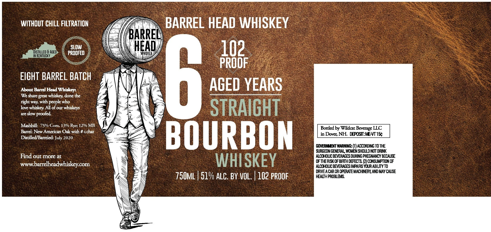

# TTB COLA Label Images - TTBID 26245001000030

**Brand Name:** BARREL HEAD WHISKEY

**Issue Date:** 09/10/2026

**Origin Code:** 33

**Product Class/Type:** 101

**Source:** [TTB Public COLA Registry](https://ttbonline.gov/colasonline/viewColaDetails.do?action=publicFormDisplay&ttbid=26245001000030)

## Label Images

### Label 1

## Extracted Label Text

*Text extracted via OCR - may contain errors*

**Detected Proof:** 102

### Label 1

WITHOUT CHILL FILTRATION
BARREL HEAD WHISKEY
BARRE
DISTILLED & AGED
PRUDFED
HEAD
WHISKEI
102
IN KENTUCKY
PROOF
EIGHT
About Barrel
BARREL BATCH
6
AGED YEARS
We share great whiskey done the
right way with people who
love whiskey All of our whiskeys
STRAIGHT
are skw proofed
Mashbill; 75% Corn, 13% Ryes 12% MB
Bottled by Wildcat Beverage LLC
Barrel: New American Oak with # 4char
Distilled/Barreled: July 2020
BOURBON
in Dover; NH PFPOSTMEMT1R
GOVERHEITWARNING: (I)ACCORDING TOTHE
SURGEONGENERAL WOMENSHOULD NOT DRINK
Find out more at
ALCOHOVCBEVERAGES CURING FREGNANCY BECAUSE
WHISKEY
CFTHERISKOFBIRTH LEFECTS (2) CCNSUMPTICN OF
wwW
barrelheadwhiskeycom
ALCOHOLCBEVERAGES IMPAIRS YOURABILIY TO
DRIVEACAR ORCFERATE MACHINERYAND MAY CAUSE
750mL | 51% alC; BY VOL:
102 PROOF
HEAWH PROBLEMS
