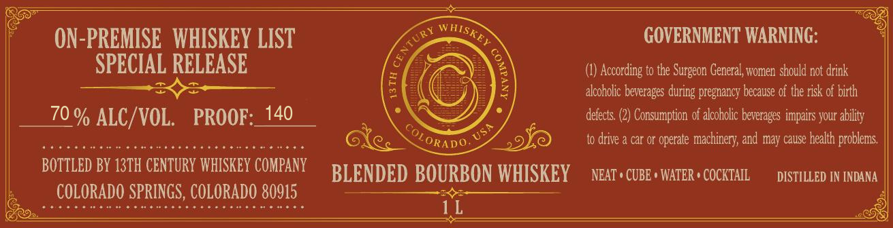

# TTB COLA Label Images - TTBID 26245001000057

**Brand Name:** 13TH CENTURY WHISKEY COMPANY

**Issue Date:** 09/28/2026

**Origin Code:** 13

**Product Class/Type:** 131

**Source:** [TTB Public COLA Registry](https://ttbonline.gov/colasonline/viewColaDetails.do?action=publicFormDisplay&ttbid=26245001000057)

## Label Images

### Back Label

## Extracted Label Text

*Text extracted via OCR - may contain errors*

**Detected Proof:** 140

### Back Label

* — ON-PREMISE WHISKEY LIST LD GOVERNMENT WARNING: = *
SPECIAL RELEASE S Shae) 2 (1) According to the Surgeon General, women should not drink
SSE 2 iG ea kes alcoholic beverages during pregnancy because of the risk of birth
___ 70% ALC i VOL. PROOF: 140 . \ — Te defects (2) Consumption of alcoholic beverages impairs your ability
FERS GEOR ISRO SLO AAOR GXe, ome 0 to drive a car or operate machinery, and may cause health problems,
BOTTLED BY 13TH CENTURY WHISKEY COMPARY BT ENDED BOURBON WHISKEY Nears cuse+waren» cockta, oisruueo w noua
s__couaann sas couoana gas ase
