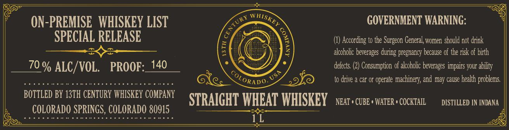

# TTB COLA Label Images - TTBID 26245001000060

**Brand Name:** 13TH CENTURY WHISKEY COMPANY

**Issue Date:** 09/10/2026

**Origin Code:** 13

**Product Class/Type:** 109

**Source:** [TTB Public COLA Registry](https://ttbonline.gov/colasonline/viewColaDetails.do?action=publicFormDisplay&ttbid=26245001000060)

## Label Images

### Label 1

## Extracted Label Text

*Text extracted via OCR - may contain errors*

**Detected Proof:** 140

### Label 1

ON-PREMISE   WHISKEY LIST
GOVERNMENT WARNING:
SPECIAL RELEASE
According to the Surgeon General, women should not drink
alcoholic beverages
pregnancy because of the risk of birth
70 % ALC/VOL.
PROOF:_140
defects
Consumption of alcoholic beverages impairs your ability
29
to drive & car or operate
machinery; and may cause health problems
BOTTLED BY 13TH CENTURY WHISKEY COMPANY
STRAICHT WHEAT WHISKEY
NEAT ' CUBE ' WATER ' COCKTAIL
DISTILLED IN INDANA
COLORADO SPRINGS, COLORADO 80915
1L
NHISKEY
cenTURY
1
during
USA
OLORADO.
