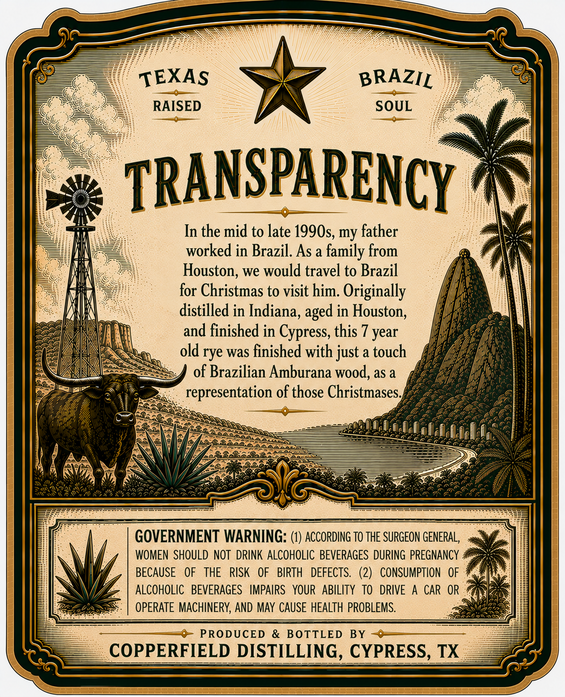
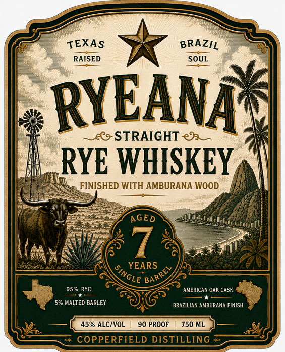

# TTB COLA Label Images - TTBID 26245001000076

**Brand Name:** COPPERFIELD DISTILLING

**Fanciful Name:** RYEANA

**Issue Date:** 09/15/2026

**Origin Code:** 44

**Product Class/Type:** 102

**Source:** [TTB Public COLA Registry](https://ttbonline.gov/colasonline/viewColaDetails.do?action=publicFormDisplay&ttbid=26245001000076)

## Label Images

### Back Label

### Front Label

## Extracted Label Text

*Text extracted via OCR - may contain errors*

**Detected Proof:** 90

### Back Label

TEXAS
BRAZIL
RAISED
SOUL
TRANSPARENCY
In the mid to late 1990s, my father
worked in Brazil. As
family from
Houston, we
travel to Brazil
for Christmas to visit him
Originally
distilled in Indiana
in Houston;
and
finished in Cypress; this
year
old rye was finished with just =
touch
of Brazilian Amburana wood,as a
representation of those Christmases
GOVERNMENT WARNING: (1) ACCORDING TO THE SURGEON GENERAL ,
WOMEN SHOULD NOT   DRINK ALCOHOLIC BEVERAGES DURING PREGMANCY
BECAUSE   OF
RISK
OF   BIRTH   DEFECTS
CONSUMPTION
ALCOHOLIC   BEVERAGES
IMPAIRS   YOUR   ABILITY   TO
DRIVE
CAR OR
OPERATE MACHIMERY, AND May CAUSE HEALTH PROBLEMS:
PRODUCED
BOTTLED
COPPERFIELD DISTILLING, CYPRESS, TX
would
aged

### Front Label

TEXAS
BRAZIL
RAISED
SOUL
RYEANA
(9
STRAIGHT
RYE WHISKEY
FINISHED WITH AMBURANA WOOD
AGED
YEARS
95%0 RYE
AMERICAN OAK CASK
59 MALTED BARLEY
BRAZILIAN AMBURANA FINISH
45% ALCIVOL
90 PROOF
750 ML
COPPERFIELD DISTILLING
SINGLE
'BARREI
