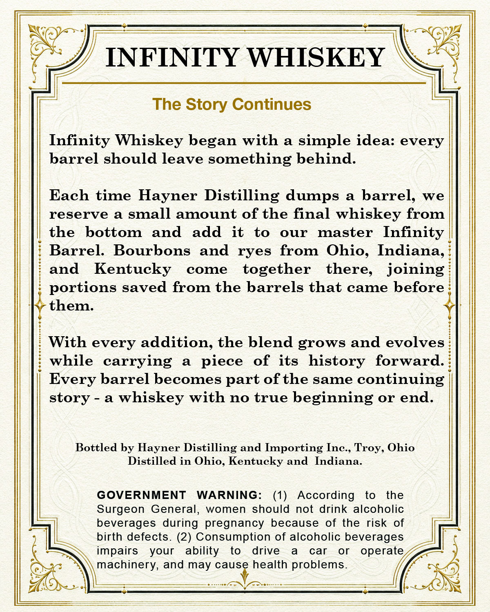
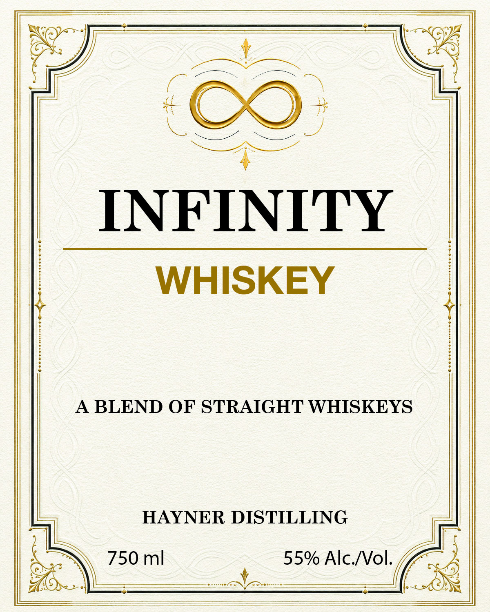

# TTB COLA Label Images - TTBID 26245001000100

**Brand Name:** HAYNER DISTILLING

**Fanciful Name:** INFINITY WHISKEY

**Issue Date:** 09/11/2026

**Origin Code:** 09

**Product Class/Type:** 129

**Source:** [TTB Public COLA Registry](https://ttbonline.gov/colasonline/viewColaDetails.do?action=publicFormDisplay&ttbid=26245001000100)

## Label Images

### Back Label

### Label 1

## Extracted Label Text

*Text extracted via OCR - may contain errors*

**Detected Proof:** 110

### Back Label

INFINITY WHISKEY
The Story Continues
Infinity Whiskey began with
a
simple idea:
e
rrel should leave something behind_
Each
time Hayner Distilling dumps
a
barrel
we
reserve
a
small amount of the final whiskey
from
the
bottom
and
add
it
to
our
master
Infinity
Barrel:
Bourbons
and
ryes
from
Ohio_
Indiana
Kentucky
come
together
there.
joining
portions saved
from the barrels that
came
before
them_
With every addition
the blend grows and evolves
while
carrying
a
of
its
history
forward
Every barrel becomes part of the
same
continuing
story
a
whiskey with no true beginning
or
end_
Bottled by Hayner Distilling and
Importing
Inc._
Tror
Ohio
Distilled in Ohio
Kentucky and
Indiana
GOVERNMENT
WARNING:
(1)
According
to
the
Surgeon General,
women should
not drink alcoholic
beverages during pregnancy
because of the risk
of
birth defects. (2) Consumption of alcoholic beverages
impairs
your
ability
to
drive
a
car
or
operate
machinery, and may cause health problems
and
piece

### Label 1

INFINITY
WHISKEY
BLEND OF STRAIGHT WHISKEYS
HAYNER DISTILLING
mi
55% AlcNol_
X
