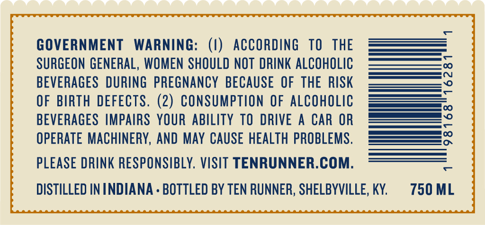

# TTB COLA Label Images - TTBID 26245001000109

**Brand Name:** TEN RUNNER

**Fanciful Name:** SINGLE BARREL

**Issue Date:** 09/09/2026

**Origin Code:** 22

**Product Class/Type:** 141

**Source:** [TTB Public COLA Registry](https://ttbonline.gov/colasonline/viewColaDetails.do?action=publicFormDisplay&ttbid=26245001000109)

## Label Images

### Back Label

### Front Label

### Label 3

## Extracted Label Text

*Text extracted via OCR - may contain errors*

*1 image(s) excluded: text did not meet readability threshold*

**Detected Proof:** 110

### Back Label

GOVERNMENT
WARNING:
ACCORDING
TO
THE
SURGEON GENERAL, WOMEN SHOULD NOT  DRINK ALCOHOLIC
BEVERAGES DURING PREGNANCY BECAUSE OF THE RISK
3
OF BIRTH DEFECTS. (2) CONSUMPTION OF ALCOHOLIC
BEVERAGES  AMPAIRS YOUR ABILITY TO
DRIVE
A
CAR OR
2
OPERATE MACHINERY, AND MAY CAUSE HEALTH PROBLEMS.
PLEASE DRINK RESPONSIBLY, VISIT TENRUNNER.COM:
DISTILLED IN INDIANA . BOTTLED BY TEN RUNNER; SHELBYVILLE, KY:
750 ML

### Label 3

Oe

MASHBILL

BARREL

BOTTLE

ALC./VOL

BE) fu

TNO1

0001

55%

AGED

YEARS

110
