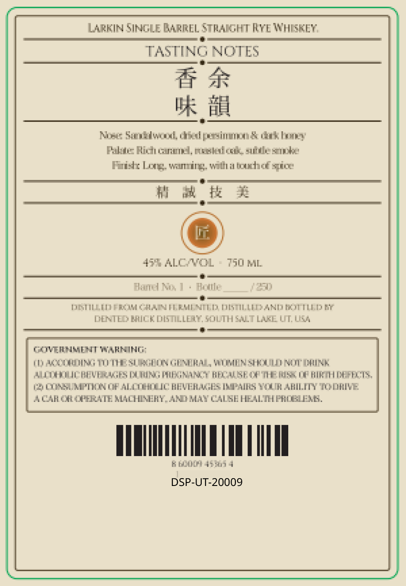
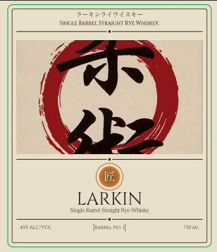

# TTB COLA Label Images - TTBID 26245001000150

**Brand Name:** DENTED BRICK DISTILLERY

**Fanciful Name:** LARKIN SINGLE BARREL STRIGHT RYE WHISKEY

**Issue Date:** 09/28/2026

**Origin Code:** 45

**Product Class/Type:** 102

**Source:** [TTB Public COLA Registry](https://ttbonline.gov/colasonline/viewColaDetails.do?action=publicFormDisplay&ttbid=26245001000150)

## Label Images

### Back Label

### Front Label

### Label 2

## Extracted Label Text

*Text extracted via OCR - may contain errors*

**Detected Proof:** 94

### Back Label

LARKIN SINGLE BARREL STRADGHT Fre WHISKEY,

*

TASTING NOTES

GF

oe i

Nose:

md wool, crbed persineno do hone

Palas Bich Garam, meth cok. subtle senoke

Finis Long. warning. with a touchof spice

fi

int

:

@

47% ALC WOL

750 fil

.

Harel Mi

Foal

=

.

TOBST ILL BD FRU CoRLAIN F ELD

1D, DISTILLED AND BOTTLED Br

DENTED BUCK DISTILLE

TH S4u

LAKE UT, Lika

COIVERNMENT WARMING:

TD) AOODRING TUTTE SLIGO £

RAUL, VELEN SPROUL eT CME,

ALIOHOUC HEY ERAGE

UG PAL

ANC? BECAUSE OP THE BESS OP AIRTH DAFRCTS.,

(2 CONSUMPTION CPF ALCT

4c

BS IMPAIRS YOUR ABILITY TOORIWE

4A CAR OR OPERATE MACHINERY, AMO MAY CAUSE HEALTH PROBLEMS.

SUL

BAM 49505 4

DSP-UT-20009

### Front Label

{7+9{3+-
sinCie MaRREL STRANCNT MSCWSMRFE
LARKIN
Slul Kumad Sunlnh Kectmky
MacOl
IARELAn Il
Jit

### Label 2

LARKIN

single Barrel Straight Rye Whisky
