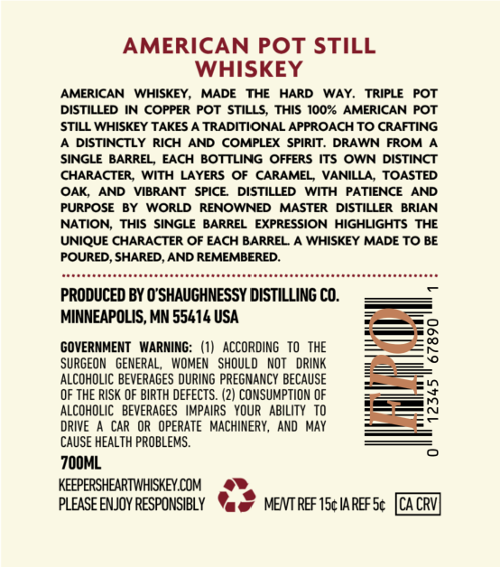
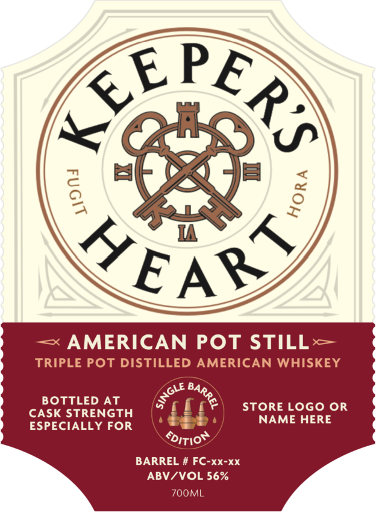

# TTB COLA Label Images - TTBID 26245001000159

**Brand Name:** KEEPER'S HEART

**Fanciful Name:** AMERICAN POT STILL

**Issue Date:** 09/09/2026

**Origin Code:** 27

**Product Class/Type:** 140

**Source:** [TTB Public COLA Registry](https://ttbonline.gov/colasonline/viewColaDetails.do?action=publicFormDisplay&ttbid=26245001000159)

## Label Images

### Back Label

### Label 1

## Extracted Label Text

*Text extracted via OCR - may contain errors*

### Back Label

AMERICAN POT STILL
WHISKEY
AMERICAN  WHISKEY ,
MADE
THE
HARD
WAY
TRIPLE
POT
DISTILLED IN COPPER
POT STILLS;
THIS 100% AMERICAN
POT
STILL WHISKEY TAKES
TRADITIONAL APPROACH TO CRAFTING
DISTINCTLY RICH
AND COMPLEX   SPIRIT
DRAWN FROM
SINGLE BARREL   EACH BOTTLING
OFFERS ITS OWN DISTINCT
CHARACTER,
WITH LAYERS
CARAMEL
VANILLA,
TOASTED
OAK,
AND
VIBRANT
SPICE
DI STILLED
WITH
PATIENCE
AND
PURPOSE
WORLD
RENOWNED
MASTER   DISTILLER   BRIAN
NATION, THIS SINGLE BARREL
EXPRESSION HIGHLIGHTS THE
UNIQUE CHARACTER OF EACH BARREL
WHISKEY MADE TO BE
POURED, SHARED, AND REMEMBERED:
PRODUCED BY O'SHAUGHNESSY DISTILLING CO.
MINNEAPOLIS, MN 55414 USA
8
GOVERNMENT   WARNING: (1)
ACCORDING  TO   THE
8
SURGEON   GENERAL_
WOMEN   SHOULd   NOT   DRINK
ALCOHOLIC BEVERAGES DURING PREGMANCY BECAUSE
OF THE RISK OF BIRTH DEFECTS. (2) CONSUMPTION OF
3
ALCOHOLIC   BEVERAGES   IMPAIRS   YOUR   ABILITY   TO
DRIVE
CAR  OR  OPERATE   MACHINERY, And  May
CAUSE HEALTH PROBLEMS.
7OOML
KEEPERSHEARTWHISKEY.COM
PLEASE ENJOY RESPONSIBLY
MENT REF 15c IA REF Sc
CACRV

### Label 1

Re8bt
1
KEARS
AMERICAN POT STILL
X
TRIPLE POt DISTILLED AMERICAN WHISKEY
BOTTLED
AT
STORE LOGo OR
CASK STRENGTH
NAME HERE
ESPECIALLY FOR
~ditior
BARREL # FC-XX-XX
ABV/VOL 56%
ZOOML
0
1
2
SINGLE
BARREL
