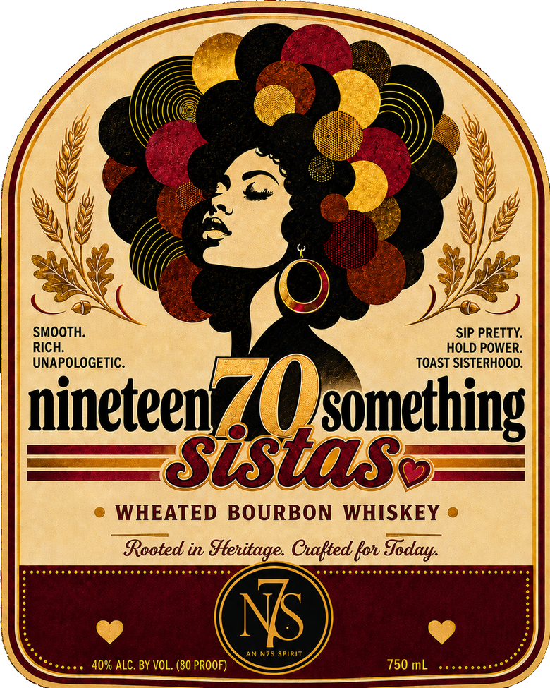
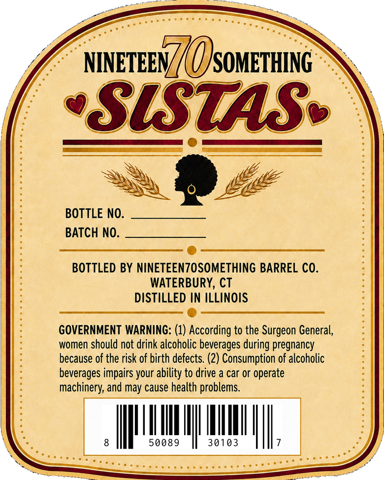

# TTB COLA Label Images - TTBID 26245001000229

**Brand Name:** NINETEEN 70 SOMETHING SISTAS

**Issue Date:** 09/09/2026

**Origin Code:** 14

**Product Class/Type:** 141

**Source:** [TTB Public COLA Registry](https://ttbonline.gov/colasonline/viewColaDetails.do?action=publicFormDisplay&ttbid=26245001000229)

## Label Images

### Front Label

### Label 2

## Extracted Label Text

*Text extracted via OCR - may contain errors*

**Detected Proof:** 80

### Front Label

SMOOTH:
SIP PRETTY:
RICH:
HOLD POWER_
UNAPOLOGETIC
TOAST SISTERHOOD:
ptcon7Qanemaggg
WHEATED BOURBON
WHISKEY
Rooted in
Henitage Cwalted kon
NS
AN N7S Spirit
40% ALC. BY VOL. (80 PROOF)
750 mL
Soday

### Label 2

NINETEEN7 (( OJSoMETHING
SlStaS
BOTTLE NO:
BATCH NO:
BOTTLED BY NINETEENZOSOMETHING BARREL CO.
WATERBURY, CT
DISTILLED IN ILLINOIS
GOVERNMENT WARNING: (1) According to the Surgeon General,
women should not drink alcoholic beverages during pregnancy
because of the risk of birth defects (2) Consumption of alcoholic
beverages impairs your ability to drive a car or operate
machinery; and may cause health problems.
50089
30103
