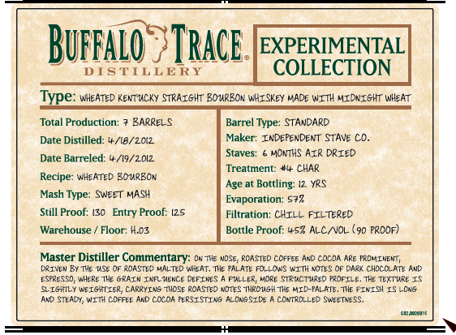

# TTB COLA Label Images - TTBID 26245001000371

**Brand Name:** BUFFALO TRACE DISTILLERY EXPERIMENTAL COLLECTION

**Issue Date:** 09/10/2026

**Origin Code:** 22

**Product Class/Type:** 101

**Source:** [TTB Public COLA Registry](https://ttbonline.gov/colasonline/viewColaDetails.do?action=publicFormDisplay&ttbid=26245001000371)

## Label Images

### Back Label

### Front Label

## Extracted Label Text

*Text extracted via OCR - may contain errors*

**Detected Proof:** 125

### Back Label

DISTILLED, AGED & BOTTLED BY
BUFFALO TRACE DISTILLERY
FRANKFORT, KY
375ML
We love to hear
from our customers
-800-729-3722
greatbourbon@buffalotrace,com
GOVERNMENT  WARNING: (1) AC-
CORDING TO THE SURGEON GENERAL,
WOMENSHOULD NOT DRNK ALCOHOLIC
BEVERAGES DURING PREGNANCY BE-
CAUSE OFTHERISK OFBIRTHDEFECTS
CONSUMPTION OF AlCOHOLIC BEV:
ERAGES IMPAIRS  YOUR  ABILITY to
dRIE A CAR OR OpeRATE MACHNERY
AND MAY CAUSE HEALTH  PROBLEMS
HaREf5+MENT REF 15, CACbV
FPO 80%
loddddldobdd
C02.0026124

### Front Label

BuFfalo
Trace .
EXPERIMENTAL
DISTILLERY
COLLECTION
Type: Wheated Kentuicky STRAIGHT BouRBon WHISKEY VADE WITH MIDNIGHT WHeat
Total Production:
3ARREL_
Barrel Type: STANDARD
Date Distilled: #/18/2C12
Maker: InDepenDent STAve Co_
Staves:
Months Azr DRIED
Date Barreled: 4 /19/2012
Treatment:
CHAR
Recipe: WHeated 3OuRBCN
Age at Bottling:
YRS
Mash Type
SWeet Mash
Evaporation; 572
Still Proof:
Proof: 125
Filtration: CHIL  FILTered
Warehouse
Floor: Hoz
Bottle Proof: 452 ALCNVOL
90 Proof)
Master Distiller Commentary: O Tle VOSe; RCASTED COffee AxD CocoA Are FROM LnENt,
By THe MSe QF Roastd Malted Whlat, The PALATE Fo_Lows WITHAons Of Dar< ChcccLAT} And
Eseresc) #Here The GRAIN InF ence DEFINEs
FXLLER; Vore StrMc7Mre) RRFILE. The 7ext ure IS
SLIShly WEISHTIER; CARRYINS Those roasted Ndtes Thrcush Tke MID-PaLKTe . The FINISH LS ~Ca&
And Steady, WITH Coffle And Cuda FERSISTINS ALOAGSIDE
CONTROLLED SwenesS;
Caiono
Entry
DRIVLw
