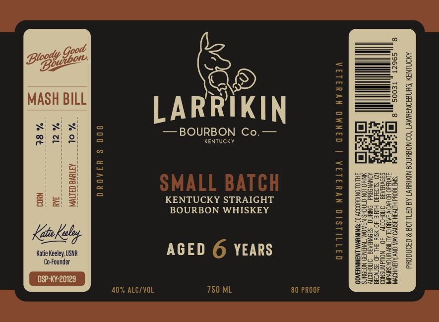

# TTB COLA Label Images - TTBID 26245001000380

**Brand Name:** LARRIKIN BOURBON CO.

**Fanciful Name:** SMALL BATCH

**Issue Date:** 09/10/2026

**Origin Code:** 22

**Product Class/Type:** 101

**Source:** [TTB Public COLA Registry](https://ttbonline.gov/colasonline/viewColaDetails.do?action=publicFormDisplay&ttbid=26245001000380)

## Label Images

### Label 1

## Extracted Label Text

*Text extracted via OCR - may contain errors*

**Detected Proof:** 80

### Label 1

Beg Sie

era)

MASH BILL

LARRIKIN

DS

Zs

— BOURBON Co.—

KENTUCKY

G

on

res

KENTUCKY STRAIGHT

BOURBON WHISKEY

a

Keto Kelp

a5

Katie Keeley, USNR

AGED © YEARS

Co-Founder

ES

40% ALC/VOL

780 ML

80 PROOF
